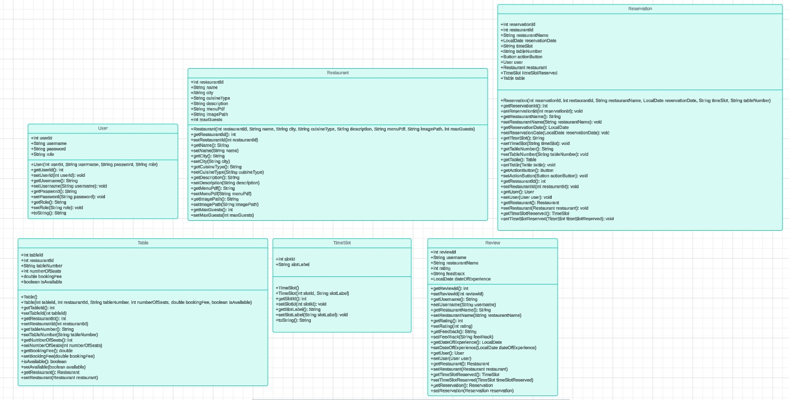
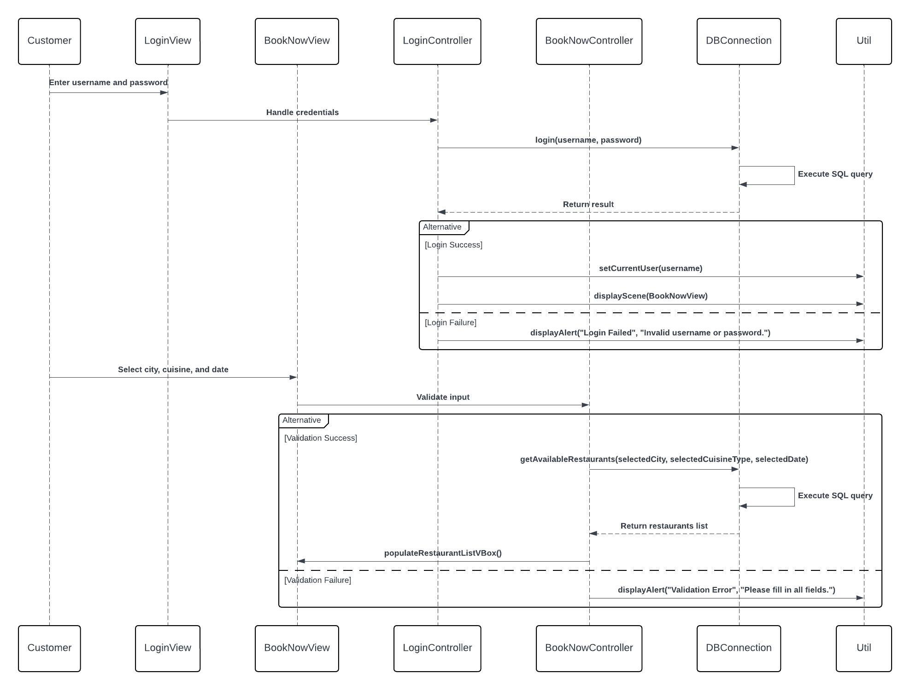

## **Description:**

This class diagram provides an overview of the primary entities involved in the **BookNow** application, including `User`, `Restaurant`, `Reservation`, `Table`, `TimeSlot`, and `Review`. Each 
entity represents a critical component of the system, with key attributes, constructors, and methods designed to facilitate interaction within the system.

### **PLEASE NOTE:**
This is a high-level overview of the attributes, constructors, and methods for each entity. These serve as an initial blueprint and are subject to modification when 
implementing the actual logic. Adjustments, additions, or removals will be made during development, depending on real-world use cases and business logic. The goal 
here is to establish the structural framework, while detailed implementation will evolve as the project progresses. If for any reason you were cross checking and happen to see that the code
is different from what's on here that means a changed happened and have not been updated to architecture.md. 
If Diagram doesn't show on github no idea. Tried trouble shooting can't fix. Working fine on intellij. Look in Diagrams folder for Diagrams.
Also please note and understand that the current initial diagrams may not match the latest version of the code, as they haven’t been updated yet. It's complicated when you lack experience and have to redo things multiple just to get what you want.
We're planning to update the diagrams once everything is finalized. We initially thought things were on track, but adjustments were necessary along the way.

## **Entities:**

### **1. User**
**Description:** Represents a user of the system, either a customer or a restaurant owner. Users can log in, create reservations, 
and interact with the system.

- **Attributes:**
    - `int userId`: The unique identifier for the user.
    - `String username`: The username chosen by the user.
    - `String password`: The password for user authentication.

- **Constructor:**
    - `User(int userId, String username, String password)`: Creates a new `User` object with the specified attributes.

- **Methods:**
    - `getUsername()`: Returns the username of the user.
---

### **2. Restaurant**
**Description:** Represents a restaurant in the system with relevant information such as location, cuisine, and menu.

- **Attributes:**
    - `int restaurantId`: The unique identifier for the restaurant.
    - `String name`: The name of the restaurant.
    - `String city`: The city where the restaurant is located.
    - `String cuisineType`: The type of cuisine the restaurant serves.
    - `String description`: A brief description of the restaurant.
    - `String menuPdf`: The file path to the restaurant's menu in PDF format.
    - `String imagePath`: The file path to the restaurant's image.
    - `int maxGuests`: The maximum number of guests the restaurant can accommodate.

- **Constructor:**
    - `Restaurant(int restaurantId, String name, String city, String cuisineType, String description, String menuPdf, String imagePath, 
int maxGuests)`: Creates a new `Restaurant` object with the specified attributes.

- **Methods:**
    - `getRestaurantId()`: Returns the unique identifier of the restaurant.
    - `setRestaurantId(int restaurantId)`: Sets the restaurant ID.
    - `getName()`: Returns the name of the restaurant.
    - `setName(String name)`: Sets the name of the restaurant.
    - `getCity()`: Returns the city where the restaurant is located.
    - `setCity(String city)`: Sets the city of the restaurant.
    - `getCuisineType()`: Returns the type of cuisine the restaurant serves.
    - `setCuisineType(String cuisineType)`: Sets the type of cuisine.
    - `getDescription()`: Returns the description of the restaurant.
    - `setDescription(String description)`: Sets the description of the restaurant.
    - `getMenuPdf()`: Returns the file path to the restaurant's menu in PDF format.
    - `setMenuPdf(String menuPdf)`: Sets the file path for the menu.
    - `getImagePath()`: Returns the file path to the restaurant's image.
    - `setImagePath(String imagePath)`: Sets the file path for the restaurant's image.
    - `getMaxGuests()`: Returns the maximum number of guests the restaurant can accommodate.
    - `setMaxGuests(int maxGuests)`: Sets the maximum number of guests.

---

### **3. Reservation**
**Description:** Represents a restaurant reservation made by a user for a specific time and table.

- **Attributes:**
    - `int reservationId`: The unique identifier for the reservation.
    - `int restaurantId`: The identifier for the restaurant.
    - `String restaurantName`: The name of the restaurant where the reservation is made.
    - `LocalDate reservationDate`: The date for the reservation.
    - `String timeSlot`: The time slot for the reservation.
    - `String tableNumber`: The table number assigned for the reservation.
    - `Button actionButton`: The action button for managing the reservation (e.g., cancel, view).
    - `User user`: The user who made the reservation.
    - `Restaurant restaurant`: The restaurant associated with the reservation.
    - `TimeSlot timeSlotReserved`: The time slot reserved for the reservation.
    - `Table table`: The table reserved for the booking.

- **Constructor:**
    - `Reservation(int reservationId, int restaurantId, String restaurantName, LocalDate reservationDate, String timeSlot, String tableNumber)`: 
Creates a new `Reservation` object with the specified attributes.

- **Methods:**
    - `getReservationId()`: Returns the unique identifier of the reservation.
    - `setReservationId(int reservationId)`: Sets the reservation ID.
    - `getRestaurantName()`: Returns the name of the restaurant for the reservation.
    - `setRestaurantName(String restaurantName)`: Sets the restaurant name.
    - `getReservationDate()`: Returns the reservation date.
    - `setReservationDate(LocalDate reservationDate)`: Sets the reservation date.
    - `getTimeSlot()`: Returns the time slot for the reservation.
    - `setTimeSlot(String timeSlot)`: Sets the time slot.
    - `getTableNumber()`: Returns the table number.
    - `setTableNumber(String tableNumber)`: Sets the table number.
    - `getTable()`: Returns the reserved table.
    - `setTable(Table table)`: Sets the reserved table.
    - `getActionButton()`: Returns the action button for managing the reservation.
    - `setActionButton(Button actionButton)`: Sets the action button.
    - `getRestaurantId()`: Returns the restaurant ID.
    - `setRestaurantId(int restaurantId)`: Sets the restaurant ID.
    - `getUser()`: Returns the user associated with the reservation.
    - `setUser(User user)`: Sets the user for the reservation.
    - `getRestaurant()`: Returns the restaurant associated with the reservation.
    - `setRestaurant(Restaurant restaurant)`: Sets the restaurant for the reservation.
    - `getTimeSlotReserved()`: Returns the time slot reserved for the reservation.
    - `setTimeSlotReserved(TimeSlot timeSlotReserved)`: Sets the reserved time slot.

---

### **4. Table**
**Description:** Represents a table available for reservation at a restaurant.

- **Attributes:**
    - `int tableId`: The unique identifier for the table.
    - `int restaurantId`: The identifier for the restaurant where the table is located.
    - `String tableNumber`: The table number within the restaurant.
    - `int numberOfSeats`: The number of seats available at the table.
    - `double bookingFee`: The fee required to reserve the table.
    - `boolean isAvailable`: Indicates whether the table is available for reservation.
    - `Restaurant restaurant`: The restaurant associated with the table.

- **Constructor:**
    - `Table()`: Creates a new `Table` object without any parameters.
    - `Table(int tableId, int restaurantId, String tableNumber, int numberOfSeats, double bookingFee, boolean isAvailable)`:
Creates a new `Table` object with the specified attributes.

- **Methods:**
    - `getTableId()`: Returns the unique identifier of the table.
    - `setTableId(int tableId)`: Sets the unique identifier of the table.
    - `getRestaurantId()`: Returns the restaurant ID where the table is located.
    - `setRestaurantId(int restaurantId)`: Sets the restaurant ID for the table.
    - `getTableNumber()`: Returns the table number.
    - `setTableNumber(String tableNumber)`: Sets the table number.
    - `getNumberOfSeats()`: Returns the number of seats at the table.
    - `setNumberOfSeats(int numberOfSeats)`: Sets the number of seats at the table.
    - `getBookingFee()`: Returns the booking fee.
    - `setBookingFee(double bookingFee)`: Sets the booking fee for the table.
    - `isAvailable()`: Returns whether the table is available for reservation.
    - `setAvailable(boolean available)`: Sets the availability of the table.
    - `getRestaurant()`: Returns the restaurant associated with the table.
    - `setRestaurant(Restaurant restaurant)`: Sets the restaurant associated with the table.

---

### **5. TimeSlot**
**Description:** Represents a time slot available for restaurant reservations.

- **Attributes:**
    - `int slotId`: The unique identifier for the time slot.
    - `String slotLabel`: The label describing the time slot (e.g., "9:00 AM - 10:00 AM").

- **Constructor:**
    - `TimeSlot()`: Creates a new `TimeSlot` object without any parameters.
    - `TimeSlot(int slotId, String slotLabel)`: Creates a new `TimeSlot` object with the specified `slotId` and `slotLabel`.

- **Methods:**
    - `getSlotId()`: Returns the unique identifier of the time slot.
    - `setSlotId(int slotId)`: Sets the unique identifier of the time slot.
    - `getSlotLabel()`: Returns the label of the time slot.
    - `setSlotLabel(String slotLabel)`: Sets the label for the time slot.
    - `toString()`: Returns a string representation of the `TimeSlot`, showing the `slotId` and `slotLabel`.

---

### **6. Review**
**Description:** Represents a review left by a customer for a restaurant.
- **Attributes:**
    - `int reviewId`: The unique identifier for the review.
    - `String username`: The username of the user leaving the review.
    - `String restaurantName`: The name of the restaurant being reviewed.
    - `int rating`: The rating given to the restaurant.
    - `String feedback`: The review comments.
    - `LocalDate dateOfExperience`: The date when the customer experienced the restaurant.
    - `User user`: The user who left the review.
    - `Restaurant restaurant`: The restaurant being reviewed.
    - `TimeSlot timeSlotReserved`: The time slot during which the review is associated.
    - `Reservation reservation`: The reservation associated with the review.

- **Constructor:**
    - `Review(int reviewId, String username, String restaurantName, int rating, String feedback, LocalDate dateOfExperience)`: 
Creates a new `Review` object with the given attributes.

- **Methods:**
    - `getReviewId()`: Returns the unique identifier of the review.
    - `setReviewId(int reviewId)`: Sets the review ID.
    - `getUsername()`: Returns the username of the reviewer.
    - `setUsername(String username)`: Sets the username.
    - `getRestaurantName()`: Returns the name of the restaurant being reviewed.
    - `setRestaurantName(String restaurantName)`: Sets the restaurant name.
    - `getRating()`: Returns the rating of the restaurant.
    - `setRating(int rating)`: Sets the rating.
    - `getFeedback()`: Returns the review comments.
    - `setFeedback(String feedback)`: Sets the review comments.
    - `getDateOfExperience()`: Returns the date of the experience.
    - `setDateOfExperience(LocalDate dateOfExperience)`: Sets the experience date.
    - `getUser()`: Returns the user who left the review.
    - `setUser(User user)`: Sets the user who left the review.
    - `getRestaurant()`: Returns the restaurant being reviewed.
    - `setRestaurant(Restaurant restaurant)`: Sets the restaurant being reviewed.
    - `getTimeSlotReserved()`: Returns the time slot reserved.
    - `setTimeSlotReserved(TimeSlot timeSlotReserved)`: Sets the time slot reserved.
    - `getReservation()`: Returns the reservation associated with the review.
    - `setReservation(Reservation reservation)`: Sets the reservation associated with the review.
  

# Class Diagram 2: Reservation System (MVC Architecture)

**Model-View-Controller (MVC)** architecture. The system is structured with three primary layers: **Models**, **Views**, and **Controllers**.

### **Models**:
The **Model** layer represents the core entities of the system. 
 - Model is already in Diagram 1

### **Views**:
The **View** layer consists of the user interface (UI) for interacting with the system. These are defined using JavaFX and FXML files:
- **LoginView**: The UI for users to log in.
- **CreateAccountView**: The UI for new users to create an account.
- **BookNowView**: The main UI where users search for restaurants and create reservations.
- **ReservationView**: The UI where users can view their reservation's. (Will Implement Soon)
- **ReviewView** The UI where users can view their reviews made. (Will Implement Soon)

### **Controllers:**
The **Controller** layer acts as the intermediary between the UI (view) and the backend logic (models).

# **BookNowController**

The `BookNowController` manages the user interface for the restaurant booking system. It handles user input, interacts with services to retrieve data, and updates the UI with restaurant search results.

## **Fields**

### **UI Elements**
- `Label lbl_welcome`: Displays a welcome message to greet the logged-in user.
- `ComboBox<String> locationComboBox`: A dropdown menu for users to select a city location for the restaurant search.
- `ComboBox<String> cb_cuisineType`: A dropdown menu for users to select the type of cuisine.
- `DatePicker checkInDate`: Allows users to pick a date for their restaurant reservation.
- `VBox restaurantVBox`: A container that will display the list of restaurants based on the search results.
- `ComboBox<Integer> cb_adults`: A dropdown menu for users to select the number of adults for the reservation.
- `ComboBox<Integer> cb_children`: A dropdown menu for users to select the number of children for the reservation.

### **Services**
- `RestaurantServices restaurantServices`: A service class responsible for handling interactions related to restaurants, such as fetching available restaurants, cities, and cuisines.
- `UserServices userServices`: Manages user-related operations, such as retrieving the current logged-in user.

## **Constructor**
- `public BookNowController()`:
  - Initializes the `BookNowController` class and the `restaurantServices` for handling restaurant-related operations.

## **Methods**

### **initialize()**
- **Purpose**: Called when the controller is initialized. Sets up the UI components and populates the combo boxes with data.
- **Key Steps**:
  - Displays a welcome message with the username of the currently logged-in user.
  - Populates the `locationComboBox` with city names and the `cb_cuisineType` with cuisine types from the `RestaurantServices`.
  - Populates the `cb_adults` and `cb_children` combo boxes with a range of selectable values for the number of adults and children.

### **onSearchButtonClick(ActionEvent event)**
- **Purpose**: Handles the search button click event, triggering a search for available restaurants based on the selected city, cuisine type, and reservation date.
- **Key Steps**:
  - Retrieves the user's selected city, cuisine type, and reservation date from the UI components.
  - Validates the search criteria. If invalid, displays an alert with a message and stops the search process.
  - If valid, queries `RestaurantServices` for available restaurants based on the selected criteria.
  - Calls `populateRestaurants()` to display the list of available restaurants in the `restaurantVBox`.

### **populateRestaurants(List<Restaurant> restaurants)**
- **Purpose**: Populates the `VBox` with the list of restaurants returned by the search query.
- **Key Steps**:
  - Clears any existing entries in the `restaurantVBox`.
  - If no restaurants are available for the selected date and criteria, displays an alert to inform the user.
  - If there are available restaurants, it loops through the list and dynamically adds each restaurant to the `VBox` by calling `addRestaurantToVBox()`.

### **addRestaurantToVBox(Restaurant restaurant)**
- **Purpose**: Dynamically adds a restaurant's details to the `VBox` for display.
- **Key Steps**:
  - Loads the `RestaurantBox.fxml` file, which contains the layout for displaying a restaurant's details.
  - Passes the restaurant data to the `RestaurantBoxController` to update the UI elements with the restaurant's information.
  - Adds the `VBox` representing the restaurant to the `restaurantVBox`.

# **CreateNewAccountController**

The `CreateNewAccountController` is responsible for handling user input during the account creation process. It validates the input, interacts with `UserServices` to create a new user in the database, and updates the UI with feedback (success or failure) based on the account creation outcome.

## **Fields**

### **UI Elements**
- `TextField usernameField`: Input field where the user enters the desired username.
- `PasswordField passwordField`: Input field where the user enters the password.
- `PasswordField confirmPasswordField`: Input field where the user re-enters the password to confirm it.

### **Services**
- `UserServices userService`: Manages user-related operations, such as validating inputs and creating new user accounts.

### **Constants**
- `String loginViewPath`: The path to the login view (`LoginView.fxml`), used to redirect users after account creation.

## **Constructor**

### `public CreateNewAccountController()`
- Initializes the `CreateNewAccountController` and the `UserServices` instance for handling user-related operations.

## **Methods**

### **onCreateAccountButton(ActionEvent event)**
- **Purpose**: Handles the "Create Account" button click event. It performs the logic for creating a new user account.
- **Key Steps**:
  - Retrieves the input values for the username, password, and password confirmation from the UI fields.
  - Calls `UserServices` to validate the input. If validation fails (e.g., username is empty, password doesn't match), it displays the specific error message using `AlertUtil`.
  - If validation passes, attempts to create the account using `UserServices`. If successful, displays a success message using `AlertUtil` and switches to the login view using `SwitchSceneUtil`.
  - If account creation fails due to an existing username or a database error, it displays an error message using `AlertUtil`.

### **onLoginButton(ActionEvent event)**
- **Purpose**: Handles the "Log In" button click event, which redirects the user to the login page.
- **Key Steps**:
  - Uses `SwitchSceneUtil` to switch to the login view (`LoginView.fxml`).

## **Error Handling**
- **Validation Errors**: If any input is invalid (e.g., empty username or mismatched passwords), an appropriate error message is shown to the user using `AlertUtil`.
- **Database Errors**: If a database error occurs during account creation (e.g., the username already exists or the account couldn't be created), an error message is shown, and the user is asked to try again.

## **Scene Switching**
- After a successful account creation, the controller uses `SwitchSceneUtil` to load and display the login page (`LoginView.fxml`).

# **LoginController**

The `LoginController` is responsible for handling user authentication in the JavaFX application. It manages user input during login, validates credentials using `UserServices`, and updates the view based on the login outcome. It also provides navigation to the account creation page.

## **Fields**

### **UI Elements**
- `TextField usernameField`: Input field for the username entered by the user.
- `PasswordField passwordField`: Input field for the user's password.

### **Services**
- `UserServices userService`: Manages user-related operations, such as validating login credentials and handling login logic.

### **Constants**
- `String bookNowViewPath`: The path to the main application view (`BookNowView.fxml`), used after successful login.
- `String createAccountViewPath`: The path to the account creation view (`CreateAccountView.fxml`), used to redirect users to the account creation page.

## **Constructor**

### `public LoginController()`
- Initializes the `LoginController` and the `UserServices` instance for handling login-related operations.

## **Methods**

### **onLoginButtonAction(ActionEvent event)**
- **Purpose**: Handles the "Login" button click event. This method validates user input, checks login credentials, and redirects to the main application page on successful login.
- **Key Steps**:
  - Retrieves the username and password entered by the user from the UI fields.
  - Calls `UserServices` to validate the input. If validation fails (e.g., missing username or password), it displays an error message using `AlertUtil`.
  - If the fields are valid, attempts to log in using `UserServices`. If login is successful, switches to the `BookNowView` scene using `SwitchSceneUtil`.
  - If login fails, displays an error message using `AlertUtil` with a message indicating that the username or password is invalid.

### **onCreateAccountButtonAction(ActionEvent event)**
- **Purpose**: Handles the "Create Account" button click event. This method redirects the user to the account creation page.
- **Key Steps**:
  - Uses `SwitchSceneUtil` to switch to the account creation view (`CreateAccountView.fxml`).

### **switchToBookNowScene(ActionEvent event)**
- **Purpose**: A helper method to switch the scene to the main application view (`BookNowView.fxml`) after a successful login.
- **Key Steps**:
  - Uses `SwitchSceneUtil` to switch to the `BookNowView` scene.
  - If an `IOException` occurs during the scene switch, displays an error message using `AlertUtil`.

## **Error Handling**
- **Validation Errors**: If the username or password fields are empty, an appropriate error message is shown using `AlertUtil`.
- **Login Errors**: If the login credentials are incorrect, an error message is shown indicating an invalid username or password.
- **Scene Switching Errors**: If an error occurs during scene switching, an error alert is shown with the error details.

# **RestaurantBoxController**

The `RestaurantBoxController` is responsible for managing the UI components that display information about a restaurant. It interacts with `RestaurantServices` to set and display restaurant details such as the name, location, description, average rating, and restaurant image. It also includes logic placeholders for handling actions related to reviews, menu, and availability.

## **Fields**

### **UI Elements**
- `Label restaurantNameLabel`: Displays the name of the restaurant.
- `Label ratingLabel`: Displays the average rating of the restaurant.
- `Label restaurantLocationLabel`: Displays the city where the restaurant is located.
- `Label restaurantDescriptionLabel`: Displays a brief description of the restaurant.
- `ImageView restaurantImageView`: Displays an image of the restaurant.

### **Services**
- `RestaurantServices restaurantServices`: Handles business logic related to restaurants, including fetching restaurant data and calculating ratings.

## **Constructor**

### `public RestaurantBoxController()`
- Initializes the `RestaurantBoxController` and the `RestaurantServices` instance for handling restaurant-related operations.

## **Methods**

### **setRestaurantData(Restaurant restaurant)**
- **Purpose**: Sets the restaurant's data into the UI elements of the restaurant box.
- **Key Steps**:
  - Calls `setLabels()` to set the name, location, and description of the restaurant in the UI.
  - Uses `RestaurantServices` to fetch and display the average rating of the restaurant.
  - Calls `displayRestaurantImage()` to load and display the restaurant's image in the `ImageView`.

### **setLabels(Restaurant restaurant)**
- **Purpose**: A helper method to set the text for the restaurant's name, location, and description labels.
- **Key Steps**:
  - Sets the `restaurantNameLabel`, `restaurantLocationLabel`, and `restaurantDescriptionLabel` with the appropriate restaurant details.

### **displayRestaurantImage(String imagePath, ImageView imageView)**
- **Purpose**: Loads and displays the restaurant's image in the provided `ImageView`.
- **Key Steps**:
  - Checks if the `imagePath` is valid (not null or empty).
  - Tries to load the image using the provided path and sets it in the `ImageView`. If the image cannot be found, it logs an error message.

### **reviewsButton()**
- **Purpose**: Placeholder method for handling actions related to restaurant reviews.
- **Key Steps**:
  - Intended to handle logic for displaying or managing restaurant reviews.

### **menuButton()**
- **Purpose**: Placeholder method for handling actions related to the restaurant's menu.
- **Key Steps**:
  - Intended to handle logic for displaying or managing the restaurant's menu.

### **availabilityButton()**
- **Purpose**: Placeholder method for handling actions related to restaurant availability.
- **Key Steps**:
  - Intended to handle logic for checking or displaying the restaurant's availability.

## **Error Handling**
- **Image Loading Errors**: If the image path is invalid or the image file cannot be found, an error message is logged in the console.

## **Scene Interaction**
- This controller interacts with other parts of the UI by displaying restaurant information and includes placeholders for future functionality (reviews, menu, availability).

### Diagram:

# Interaction Flow

---

### Example: Interaction Flow

### **User Login Interaction Flow**

1. **User Input:**
  - The user enters their **username** and **password** in the login form, which is handled by the `LoginController`.

2. **Login Button Click:**
  - The user clicks the "Login" button, triggering the `onLoginButtonAction()` method in the `LoginController`.
  - The method validates that both fields (username and password) are filled in using `UserServices.areLoginFieldsValid()`.

3. **Database Check:**
  - The `LoginController` calls `UserServices.login(username, password)` to verify the credentials against the database.
  - The `UserServices` class uses `UserDAO.login()` to check the credentials in the database.

4. **Success Scenario:**
  - If the login is successful:
    - The `UserServices` class sets the static `currentUser` field to the logged-in user.
    - The `LoginController` then calls `SwitchSceneUtil.switchScene()` to load the `BookNowView.fxml` scene, which contains the restaurant search interface.

5. **Failure Scenario:**
  - If the login fails, an error message is displayed to the user using `AlertUtil.showErrorAlert()`.

---

## **2. Search for Restaurants Interaction Flow**

1. **User Input:**
  - The user selects a **city**, **cuisine type**, and a **date** in the search form provided in `BookNowView.fxml`. This is handled by the `BookNowController`.

2. **Search Button Click:**
  - The user clicks the "Search" button, triggering the `onSearchButtonClick()` method in the `BookNowController`.
  - The method validates the user input using `RestaurantServices.isSearchCriteriaValid()` to ensure that all fields are filled correctly (city, cuisine type, and date).

3. **Database Query:**
  - The `BookNowController` calls `RestaurantServices.findAvailableRestaurants(selectedCity, selectedCuisineType, selectedDate)` to fetch the list of restaurants that match the search criteria.
  - The `RestaurantServices` class interacts with the `RestaurantDAO.getAvailableRestaurants()` method to retrieve the data from the database.

4. **Display Results:**
  - The list of restaurants returned by `RestaurantServices` is passed back to the `BookNowController`.
  - The `populateRestaurants()` method is called to dynamically create a list of restaurants using JavaFX components.
  - Each restaurant is displayed in the interface within a `VBox` by loading the `RestaurantBox.fxml`, which shows the restaurant's name, city, description, and image.

---

## **3. Utility Interaction Flow**

1. **Scene Switching:**
  - When scenes need to be switched (e.g., after login or after account creation), the `SwitchSceneUtil.switchScene()` method is called by the appropriate controller (`LoginController` or `CreateNewAccountController`).
  - This method loads the new FXML view and ensures that the current window size and maximization state are preserved.
  - The scene switching logic ensures smooth transitions between different views while keeping the user experience consistent.

2. **Alerts and Messages:**
  - If any validation errors occur (e.g., during login, account creation, or restaurant search), the `AlertUtil.showInfoAlert()` or `AlertUtil.showErrorAlert()` method is used to display an alert with the appropriate message to the user.
  - These methods provide clear and user-friendly feedback on validation issues, login errors, and other system messages.

3. **Database Connections:**
  - The `DB_Connection_Util.getConnection()` method is responsible for establishing and managing the database connection for the application.
  - This utility ensures that the connection to the MySQL database is properly set up and provides easy access to perform database queries in various DAO classes (e.g., `UserDAO`, `RestaurantDAO`).
  - The connection handling also includes error management in case the database connection fails.

# **Adherence to MVC Principles**

The **BookNow** application follows the **Model-View-Controller (MVC)** architecture pattern to ensure separation of concerns. This design promotes modularity and maintainability by dividing the application into three layers: **Models**, **Views**, and **Controllers**. Below is an analysis of how the application adheres to the MVC principles based on the current code.

---

## **1. Models:**
The **Model** layer represents the core entities and data logic of the application, encapsulating business rules and data interaction.

### **Entities:**
- `User`: Represents a user of the system (a customer), with fields for user ID, username, and password.
- `Restaurant`: Represents a restaurant with attributes such as name, city, cuisine type, description, maxGuests, menu, and image path.
- `Reservation`: Represents a reservation at a restaurant, including reservation ID, restaurant ID, date, time slot, and table number.
- `Review`: Represents a review given by a user for a restaurant, including fields for review ID, rating, feedback, and date of experience.
- `Table`: Represents a table at a restaurant with fields for table ID, number of seats, booking fee, and availability.
- `TimeSlot`: Represents available time slots for restaurant reservations.

### **Data Logic:**
- The `UserDAO`, `RestaurantDAO`, and other DAO classes handle all interactions with the database. These classes manage operations such as logging in, account creation, and fetching restaurant data based on search criteria.
- The `DB_Connection_Util` class is responsible for establishing and managing connections to the database.

### **Strengths in the Model Layer:**
- **Low Coupling**: The model layer is decoupled from the view and controller layers. The data logic is handled in the DAO classes, ensuring that the business logic and database operations are separated from the user interface and control flow.

---

## **2. Views:**
The **View** layer is responsible for displaying the user interface, defined using **JavaFX** FXML files.

### **Key Views:**
- **LoginView.fxml**: Displays the login interface where the user enters their credentials.
- **BookNowView.fxml**: Provides the restaurant search interface with options to select a location, cuisine type, and date.
- **CreateAccountView.fxml**: Provides the interface for users to create a new account.
- **RestaurantBox.fxml**: Displays individual restaurant details such as the name, location, description, rating, and image.

### **Strengths in the View Layer:**
- **Cohesion**: The view layer focuses solely on rendering the user interface and capturing user input. Business logic is kept out of the view files.
- **Modular UI**: Each view (login, account creation, restaurant search) is modular, making the UI easier to maintain and extend.

---

## **3. Controllers:**
The **Controller** layer acts as the intermediary between the models and views. Each controller listens to user events, processes the input through the service layer, and updates the view accordingly.

### **Controllers in the Application:**
- **LoginController**:
  - Manages user login functionality.
  - Uses `UserServices.login()` to check user credentials.
  - On successful login, it switches to `BookNowView.fxml` using `SwitchSceneUtil.switchScene()`. If login fails, it displays an error using `AlertUtil.showErrorAlert()`.

- **BookNowController**:
  - Handles the restaurant search functionality.
  - Validates user input (city, cuisine type, and date) using `RestaurantServices.isSearchCriteriaValid()` and interacts with `RestaurantServices.findAvailableRestaurants()` to retrieve the relevant data.
  - Populates the restaurant list in the UI using the `populateRestaurants()` method.

- **CreateNewAccountController**:
  - Manages the creation of new user accounts.
  - Uses `UserServices.createAccount()` to insert a new user into the database.
  - Displays alerts for success or failure and switches to the login screen upon successful account creation.

### **Strengths in the Controller Layer:**
- **Controller Interactions with Models**: Controllers interact with the `UserServices` and `RestaurantServices` classes, which handle data manipulation and business logic. The controllers don’t interact with the DAOs directly, ensuring separation of concerns.
- **Validation Logic**: Controllers handle user input validation before interacting with the model layer to ensure valid data is passed to the database.
- **Scene Management**: Controllers use `SwitchSceneUtil` for transitioning between views, which ensures separation of UI rendering and logic flow.

---

## **4. Communication Between Layers:**

- **From View to Controller**:
  - User interactions such as button clicks (e.g., login or search) trigger event handlers defined in the controller classes. For example, the `onLoginButtonAction()` method in `LoginController` is triggered when the login button is clicked.

- **From Controller to Model**:
  - Controllers interact with the model layer via `UserServices` and `RestaurantServices`. For example, `UserServices.login()` is called from `LoginController` to verify user credentials, and `RestaurantServices.findAvailableRestaurants()` is called from `BookNowController` to fetch available restaurants based on user input.

- **From Controller to View**:
  - Once the controller receives data from the model, it updates the view accordingly. For instance, the `BookNowController` populates the restaurant list in the view after fetching the search results from `RestaurantServices`.

---

## **Key Principles Followed:**

1. **High Cohesion**:
  - Each layer has a well-defined responsibility. The views handle UI rendering, controllers manage interaction between layers, and models handle data and business logic.

2. **Low Coupling**:
  - The layers are kept separate, allowing for independent development and maintenance. Controllers only interact with the service layer (`UserServices`, `RestaurantServices`), while the view layer remains unaware of the data source and business logic.

3. **Layered Communication**:
  - Data flows from the user (via the view), through the controller, to the model, and then back to the view. This clear communication flow ensures that the data, presentation, and control logic are decoupled.

---
# Sequence Diagram for Customer Login and Restaurant Search

## **Overview:**

This sequence diagram illustrates the interaction between the **View**, **Controller**, and **Model** layers in the `BookNow` application during two primary use cases:
1. **Customer Login**: A customer logs into the application.
2. **Restaurant Search**: After logging in, the customer searches for available restaurants based on location, cuisine type, and date.

The diagram follows the **Model-View-Controller (MVC)** pattern and demonstrates how user inputs from the view are passed to the controller, processed in the model (via `UserServices` and `RestaurantServices`), and how the resulting data is returned to the view.

---

## **Actors Involved:**
- **Customer**: The user who interacts with the system.
- **View Layer (JavaFX)**:
  - **LoginView**: The login interface presented to the customer.
  - **BookNowView**: The search interface for finding restaurants.
- **Controller Layer**:
  - **LoginController**: Handles user login events.
  - **BookNowController**: Handles restaurant search events.
- **Model Layer**:
  - **UserServices**: Interacts with the **UserDAO** to verify login credentials.
  - **RestaurantServices**: Interacts with the **RestaurantDAO** to fetch restaurant details.

---

## **Login Use Case Sequence:**
1. **Customer enters username and password** in the `LoginView`.
2. The **LoginController** calls the `login()` method from the **UserServices** class to verify the login credentials.
3. The **UserServices** class calls `UserDAO.login()` to execute a SQL query and check the database for matching credentials.
4. The result (success or failure) is returned to the **LoginController** via the `UserServices` class.
5. If successful:
  - The **UserServices** class sets the static `currentUser` variable to the logged-in user.
  - The **LoginController** calls `SwitchSceneUtil.switchScene()` to transition the view to the **BookNowView** (restaurant search interface).
6. If login fails, an error message is displayed to the customer via `AlertUtil.showErrorAlert()`.

---

## **Restaurant Search Use Case Sequence:**
1. **Customer selects location, cuisine type, and date** from the dropdowns and date picker in the `BookNowView`.
2. The **BookNowController** validates the input using `RestaurantServices.isSearchCriteriaValid()` to ensure all fields are properly filled out. If validation fails, it calls `AlertUtil.showInfoAlert()` to inform the user.
3. If validation passes, the **BookNowController** calls the `findAvailableRestaurants()` method from the **RestaurantServices** class to fetch matching restaurants.
4. The **RestaurantServices** class interacts with `RestaurantDAO.getAvailableRestaurants()` to execute a SQL query and retrieve restaurants based on the selected city, cuisine type, and date.
5. The list of available restaurants is returned to the **BookNowController** via the `RestaurantServices` class.
6. The **BookNowController** populates the `VBox` in the **BookNowView** with restaurant details such as name, city, and description using the `populateRestaurants()` method.

## **Sequence Diagram:**

