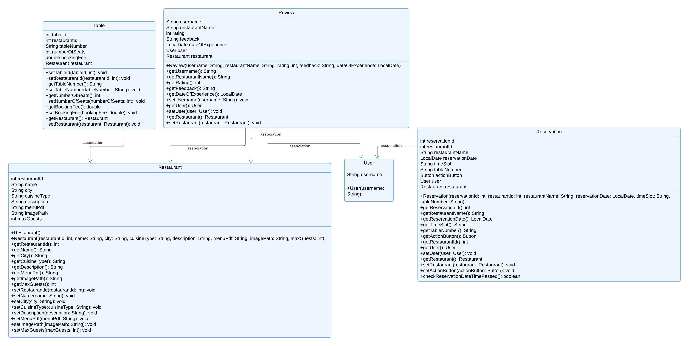

## **Description:**

This class diagram provides an overview of the primary entities in the BookNow application: `User`, `Restaurant`, `Reservation`, `Table`, and `Review`. Each entity represents a core component of the system, with essential attributes, constructors, and methods that enable interactions within the application.

### **PLEASE NOTE:**
This is a high-level overview of the attributes, constructors, and methods for each entity. These serve as an initial blueprint and are subject to modification when 
implementing the actual logic. Adjustments, additions, or removals will be made during development, depending on real-world use cases and business logic. The goal 
here is to establish the structural framework, while detailed implementation will evolve as the project progresses. If for any reason you were cross checking and happen to see that the code
is different from what's on here that means a changed happened and have not been updated. 
If Diagram doesn't show on github no idea. Tried trouble shooting can't fix. Working fine on intellij. Look in Diagrams folder for Diagrams.
Also please note and understand that the current initial diagrams may not match the latest version of the code, as they haven’t been updated yet. It's complicated when you lack experience and have to redo things multiple just to get what you want.
We're planning to update the diagrams once everything is finalized. We initially thought things were on track, but adjustments were necessary along the way.

# Entities Class Diagram

# Entities

## 1. User

### Description
Represents a user of the system, who can log in and create reservations.

### Attributes

- `String username`: The username chosen by the user.

### Constructor

- `User(String username)`: Creates a new User object with the specified username.

## 2. Restaurant

### Description
Represents a restaurant in the system with relevant information, such as location, cuisine, and menu.

### Attributes

- `int restaurantId`: The unique identifier for the restaurant.
- `String name`: The name of the restaurant.
- `String city`: The city where the restaurant is located.
- `String cuisineType`: The type of cuisine the restaurant serves.
- `String description`: A brief description of the restaurant.
- `String menuPdf`: The file path to the restaurant's menu in PDF format.
- `String imagePath`: The file path to the restaurant's image.
- `int maxGuests`: The maximum number of guests the restaurant can accommodate.

### Constructor

- `Restaurant(int restaurantId, String name, String city, String cuisineType, String description, String menuPdf, String imagePath, int maxGuests)`: Creates a new Restaurant object with the specified attributes.

## 3. Reservation

### Description
Represents a restaurant reservation made by a user for a specific time and table.

### Attributes

- `int reservationId`: The unique identifier for the reservation.
- `int restaurantId`: The identifier for the restaurant.
- `String restaurantName`: The name of the restaurant where the reservation is made.
- `LocalDate reservationDate`: The date for the reservation.
- `String timeSlot`: The time slot for the reservation.
- `String tableNumber`: The table number assigned for the reservation.
- `Button actionButton`: The action button for managing the reservation (e.g., cancel, view).
- `User user`: The user who made the reservation.
- `Restaurant restaurant`: The restaurant associated with the reservation.

### Constructor

- `Reservation(int reservationId, int restaurantId, String restaurantName, LocalDate reservationDate, String timeSlot, String tableNumber)`: Creates a new Reservation object with the specified attributes.

## 4. Table

### Description
Represents a table available for reservation at a restaurant.

### Attributes

- `int tableId`: The unique identifier for the table.
- `int restaurantId`: The identifier for the restaurant where the table is located.
- `String tableNumber`: The table number within the restaurant.
- `int numberOfSeats`: The number of seats available at the table.
- `double bookingFee`: The fee required to reserve the table.
- `Restaurant restaurant`: The restaurant associated with the table.

### Constructor

- `Table()`: Creates a new Table object without any parameters.

## 5. Review

### Description
Represents a review left by a user for a restaurant.

### Attributes

- `String username`: The username of the user leaving the review.
- `String restaurantName`: The name of the restaurant being reviewed.
- `int rating`: The rating given to the restaurant.
- `String feedback`: The review comments.
- `LocalDate dateOfExperience`: The date when the user experienced the restaurant.
- `User user`: The user who left the review.
- `Restaurant restaurant`: The restaurant being reviewed.

### Constructor

- `Review(String username, String restaurantName, int rating, String feedback, LocalDate dateOfExperience)`: Creates a new Review object with the specified attributes.

---

# BookNow System Architecture

The BookNow system follows the `Model-View-Controller` (MVC) architecture, with additional `DAO`, `Service` and `Utils` layers for better modularity, encapsulation, and code maintainability.
Each layer serves a specific role in the application, facilitating interactions between the user interface, business logic, and data access.

**Model-View-Controller (MVC)** architecture. 
- The system is structured with three primary layers: **Models**, **Views**, and **Controllers**.

### **Models**:
The **Model** layer represents the core entities of the system. 
 - Model is already in Diagram 1

### **Views**:
The **View** layer consists of the user interface (UI) for interacting with the system. These are defined using JavaFX and FXML files:
- **LoginView**: UI for users to log in.
- **CreateAccountView**: UI for new users to create an account.
- **BookNowView**: Main UI for searching restaurants and creating reservations.
- **ReservationView**: UI where users can view and manage their reservations.
- **CreateReviewView**: UI where user create their review.
- **ReviewView**: UI where users can view and manage their reviews.

### **Controllers:**
The Controller layer acts as the intermediary between the UI (view) and the backend logic, handling user inputs, managing interactions with services, and updating the UI accordingly. Each controller in the BookNow system serves a distinct role within the application, managing specific tasks and features.

# BookNowController

The `BookNowController` manages the user interface of the restaurant booking feature, handling user inputs, updating the UI state, and coordinating with backend services to perform necessary operations such as searching for restaurants, checking availability, making reservations, and managing reviews

## Fields

### UI Elements

- **`Label lbl_welcome`**: Displays a personalized welcome message.
- **`ComboBox<String> locationComboBox`**: Allows users to select a city location for searching restaurants.
- **`ComboBox<String> cb_cuisineType`**: Enables selection of the cuisine type.
- **`ComboBox<Integer> cb_adults`**: Allows the selection of the number of adults for the reservation.
- **`ComboBox<Integer> cb_children`**: Allows the selection of the number of children for the reservation.
- **`DatePicker checkInDate`**: Lets users select a reservation date.
- **`VBox restaurantListVBox`**: Displays the list of search results for restaurants.
- **`VBox reviewsOverlay`**: Shows the reviews for a selected restaurant.
- **`VBox availabilityVBox`**: Displays the available time slots and tables for reservations.

### Properties

- **`private String selectedCity`**: The city selected by the user for searching restaurants.
- **`private String selectedCuisineType`**: The cuisine type selected by the user.
- **`private LocalDate selectedDate`**: The reservation date selected by the user.
- **`private int totalGuests`**: The total number of guests for the reservation.
- **`private String selectedTimeSlot`**: The selected time slot for the reservation.

### Services

- **`private final BookNowFacadeService serviceManager`**: A facade service that simplifies complex operations by coordinating multiple services.

## Constructor

- **`public BookNowController()`**: Initializes the `BookNowController` and sets up the `serviceManager` with a new `DBConnection`.

## Methods

- **`@FXML public void initialize()`**: Initializes the UI components, populating dropdowns with data from `BookNowFacadeService`.
  - Sets a personalized welcome message.
  - Populates location, cuisine type, and guest number dropdowns.

- **`public void onSearchButtonClick(ActionEvent event)`**: Handles restaurant search requests based on user input.
  - Retrieves user-selected search criteria.
  - Triggers a search for restaurants through `serviceManager`.

- **`public void handleShowAvailability(Restaurant restaurant)`**: Displays available tables and time slots for the selected restaurant.
  - Sets `selectedDate` and `totalGuests`.
  - Calls `serviceManager` to show availability information.

- **`public void handleReserveTable(Restaurant restaurant, Table table)`**: Confirms a reservation for a specified restaurant and table.
  - Calls `serviceManager` to reserve a table.
  - Displays confirmation or failure alert.

- **`public void handleReadReviews(Restaurant restaurant)`**: Displays reviews for the selected restaurant.
  - Fetches reviews from `serviceManager`.
  - Displays reviews in `reviewsOverlay`.

- **`public void handleViewMenu(Restaurant restaurant)`**: Opens the restaurant's menu in a PDF viewer.
  - Delegates the task to `serviceManager`.

- **`public void handleBackToRestaurants()`**: Navigates back to the restaurant list view.
  - Calls `showRestaurantListView()` to manage view visibility.

- **`public void setSelectedTimeSlot(String selectedTimeSlot)`**: Sets the selected time slot for reservation.

- **`public void showAvailabilityView()`**: Shows the availability view and hides other views.
  - Manages visibility of `restaurantListVBox` and `availabilityVBox`.

- **`public void showRestaurantListView()`**: Shows the restaurant list view and hides other views.
  - Manages visibility of `availabilityVBox` and `reviewsOverlay`.

- **`public void onViewMyReservationsClick(ActionEvent event)`**: Navigates to the reservations view.
  - Uses `UIUtil` to display the Reservations view scene.

- **`public void onViewMyReviewsClick(ActionEvent event)`**: Navigates to the reviews view.
  - Uses `UIUtil` to display the Reviews view scene.

# CreateNewAccountController

The `CreateNewAccountController` manages the user interface and business logic for creating new user accounts. It handles user input validation and account creation by interacting with the `UserService`.

## Fields

### UI Elements

- **`TextField usernameField`**: Field for users to input their desired username.
- **`PasswordField passwordField`**: Field for users to input their desired password.
- **`PasswordField confirmPasswordField`**: Field for users to confirm their desired password.

### Services

- **`private final UserService userService`**: Manages user account-related operations such as validation and creation.

## Constructor

- **`public CreateNewAccountController()`**: Initializes the `CreateNewAccountController` and sets up the `userService`.

## Methods

- **`public void onCreateAccountButtonAction(ActionEvent event)`**: Handles the action when the "Create Account" button is clicked.
  - Retrieves the text input from `usernameField`, `passwordField`, and `confirmPasswordField`.
  - Validates the inputs and tries to create a new account using `userService`.
  - Displays a success alert and navigates to the `BookNowView` if the account creation is successful.
  - Displays an error alert if there's an issue during account creation, such as validation failure or an SQL exception.

- **`public void onLoginButtonAction(ActionEvent event)`**: Handles the action when the "Login" button is clicked.
  - Navigates to the Login view (`LoginView.fxml`).

# CreateReviewController

The `CreateReviewController` handles the user interface and business logic for creating a new review for a reservation. It manages user input, validates and submits the review, and provides a form for users to input their feedback.

## Fields

### UI Elements

- **`Label lbl_welcome`**: Displays a personalized welcome message.
- **`Label lbl_restaurantName`**: Displays the name of the restaurant for the review.
- **`Label lbl_dateOfExperience`**: Displays the date of the reservation experience.
- **`ComboBox<Integer> combo_rating`**: Allows users to select a rating for the review.
- **`TextArea txt_reviewComment`**: Field for users to input their review comments.

### Properties

- **`private int reservationId`**: The ID of the reservation being reviewed.
- **`private Reservation reservation`**: The reservation details associated with the review.

### Services

- **`private final DBConnection dbHandler`**: Manages database connections.
- **`private final ReservationService reservationService`**: Manages reservation-related operations.
- **`private final ReviewService reviewService`**: Manages review-related operations.

## Constructor

- **`public CreateReviewController()`**: Initializes the `CreateReviewController` and sets up the `dbHandler`, `reservationService`, and `reviewService`.

## Methods

- **`@FXML public void initialize()`**: Initializes the UI components. Sets a personalized welcome message.

- **`public void setReservationId(int reservationId)`**: Sets the `reservationId` and initializes the review form.
  - Calls `initializeReviewForm(reservationId)` to fetch reservation details and populate the UI.

- **`private void initializeReviewForm(int reservationId)`**: Fetches reservation details and populates the UI components.
  - Sets the restaurant name and date of experience labels.
  - Displays an alert if the reservation is not found.

- **`public void onSubmitReviewClickAction(ActionEvent event)`**: Handles the action when the "Submit Review" button is clicked.
  - Retrieves the rating and feedback from user inputs.
  - Validates and submits the review using `reviewService`.
  - Displays an alert indicating the success or failure of the review submission.

- **`public void onSearchRestaurantsClickAction(ActionEvent event)`**: Handles the action when the "Search Restaurants" button is clicked.
  - Navigates to the main application view (`BookNowView.fxml`).

# LoginController

The `LoginController` manages the user interface and business logic for user login. It handles user input validation and authentication.

## Fields

### UI Elements

- **`TextField usernameField`**: Field for users to input their username.
- **`PasswordField passwordField`**: Field for users to input their password.

### Services

- **`private final UserService userService`**: Manages user account-related operations such as login and authentication.

## Constructor

- **`public LoginController()`**: Initializes the `LoginController` and sets up the `userService`.

## Key Methods

- **`public void onLoginButtonAction(ActionEvent event)`**: Handles the action when the "Login" button is clicked.
  - Retrieves the text input from `usernameField` and `passwordField`.
  - Validates that both fields are not empty.
  - Attempts to authenticate the user using `userService`.
  - Displays a success alert and navigates to the main application view (`BookNowView.fxml`) if login is successful.
  - Displays an error alert if the login fails due to incorrect username or password, or if an SQL exception occurs.

- **`public void onCreateAccountButtonAction(ActionEvent event)`**: Handles the action when the "Create Account" button is clicked.
  - Navigates to the Create Account view (`CreateAccountView.fxml`).

# ReservationsController

The `ReservationsController` manages the user interface and functionality related to displaying and managing user reservations. It provides mechanisms to view reservation details, welcome the user, and navigate to the search restaurants view.

## Fields

### UI Elements

- **`Label lbl_welcome`**: Displays a personalized welcome message.
- **`TableView<Reservation> reservationsTable`**: A table view to display the list of reservations.
- **`TableColumn<Reservation, String> restaurantNameColumn`**: Table column to display the restaurant name.
- **`TableColumn<Reservation, String> reservationDateColumn`**: Table column to display the reservation date.
- **`TableColumn<Reservation, String> timeSlotColumn`**: Table column to display the time slot of the reservation.
- **`TableColumn<Reservation, String> tableNumberColumn`**: Table column to display the table number.
- **`TableColumn<Reservation, Button> actionColumn`**: Table column to display the action buttons (e.g., cancel reservation).

### Services

- **`private final ReservationUIManager reservationUIManager`**: Manages the user interface elements and interactions related to reservations.

## Constructor

- **`public ReservationsController()`**: Initializes the `ReservationsController` and sets up the `reservationUIManager`.

## Methods

**` `@FXML public void initialize()`
- Initializes the UI components.
- Sets the welcome message with the username.
- Calls `reservationUIManager.setUpTableColumns()` to configure the table columns.
- Calls `loadReservations()` to populate the reservations table.

**` `private void loadReservations()`
- Loads the reservations for the current user.
- Calls `reservationUIManager.loadReservations()` and passes the current user's reservations list.

- **`public void onSearchRestaurantsClick(ActionEvent event)`**:
- Handles the action when the "Search Restaurants" button is clicked.
- Navigates to the main application view (`BookNowView.fxml`).

# ReviewController

The `ReviewController` manages the user interface and functionality related to displaying and managing user reviews. It provides mechanisms to view review details, welcome the user, and navigate to the search restaurants view.

## Fields

### UI Elements

- **`Label lbl_welcome`**: Displays a personalized welcome message.
- **`TableView<Review> reviewsTable`**: A table view to display the list of reviews.
- **`TableColumn<Review, String> restaurantNameColumn`**: Table column to display the restaurant name.
- **`TableColumn<Review, String> dateOfExperienceColumn`**: Table column to display the date of the user's dining experience.
- **`TableColumn<Review, String> ratingColumn`**: Table column to display the rating given by the user.
- **`TableColumn<Review, String> feedbackColumn`**: Table column to display feedback comments.

### Services

- **`private final ReviewService reviewService`**: Manages interactions with the review data source.
- **`private final ReviewUIManager reviewUIManager`**: Manages the user interface elements and interactions related to reviews.

## Constructor

- **`public ReviewController()`**: Initializes the `ReviewController` and sets up the `reviewService` and `reviewUIManager`.

## Methods

### `@FXML public void initialize()`
- Initializes the UI components.
- Sets the welcome message with the username.
- Calls `reviewUIManager.setUpTableColumns()` to configure the table columns.
- Calls `loadReviews()` to populate the reviews table.

### `private void loadReviews()`
- Loads the reviews for the current user.
- Calls `reviewUIManager.loadReviews()` and passes the current user's review list.
- Sets the items in the `reviewsTable` with the loaded reviews.

### `public void onSearchRestaurantsClick(ActionEvent event)`
- Handles the action when the "Search Restaurants" button is clicked.
- Navigates to the main application view (`BookNowView.fxml`)

## Additional Layers

## DAO (Data Access Object)

The DAO layer abstracts and encapsulates all interactions with the database, providing a way for services to perform CRUD operations. Each DAO class manages data retrieval and storage for a specific entity.

### Core DAO Classes

- **UserDAO**: Manages database operations related to users, such as login and account creation.
- **RestaurantDAO**: Handles retrieval and storage of restaurant information.
- **ReservationDAO**: Manages reservation records, including creation, retrieval, and cancellation.
- **TableDAO**: Handles database operations related to tables, like checking availability.
- **ReviewDAO**: Manages CRUD operations for reviews, including retrieving and submitting reviews.

## Service Layer

The Service layer contains business logic that intermediates between Controllers and DAOs. Services manage application logic, enforce rules, and perform data transformations where needed. This layer allows Controllers to request higher-level operations without handling complex database interactions directly.

### Core Service Classes

- **UserService**: Manages user-related operations, such as authentication and account management.
- **RestaurantService**: Handles business logic related to restaurants, like fetching available restaurants and cuisines.
- **ReservationService**: Manages reservation-related logic, including availability checks, reservation creation, and cancellation.
- **TableService**: Handles table-related operations, including seat capacity checks and table reservations.
- **ReviewService**: Manages review-related functionality, such as fetching and submitting user reviews.
- **BookNowFacadeService**: A facade service that coordinates interactions across multiple services to simplify complex tasks for controllers.

## Utility Classes

The Utils package provides helper classes to support common tasks, such as database connections, UI alerts, and scene transitions.

### Core Utility Classes

- **DBConnection**: Manages database connection settings and establishes connections for DAOs.
- **UIUtil**: Contains utility methods for displaying alerts, managing scene transitions, and populating UI components.
- **RestaurantUIManager**: Manages restaurant-specific UI tasks, such as displaying restaurant lists and availability views.
- **ReservationUIManager**: Manages the UI for displaying and managing reservations.
- **ReviewUIManager**: Manages the UI for displaying and managing reviews.

---

# Interaction Flow

---

### Example: Interaction Flow

### **User Login Interaction Flow**

1. **User Input:**
  - The user enters their **username** and **password** in the login form, which is handled by the `LoginController`.

2. **Login Button Click:**
  - The user clicks the "Login" button, triggering the `onLoginButtonAction()` method in the `LoginController`.
  - The method validates that both fields (username and password) are filled in using `UserServices.areLoginFieldsValid()`.

3. **Database Check:**
  - The `LoginController` calls `UserServices.login(username, password)` to verify the credentials against the database.
  - The `UserServices` class uses `UserDAO.login()` to check the credentials in the database.

4. **Success Scenario:**
  - If the login is successful:
    - The `UserServices` class sets the static `currentUser` field to the logged-in user.
    - The `LoginController` then calls `SwitchSceneUtil.switchScene()` to load the `BookNowView.fxml` scene, which contains the restaurant search interface.

5. **Failure Scenario:**
  - If the login fails, an error message is displayed to the user using `AlertUtil.showErrorAlert()`.

---

## **2. Search for Restaurants Interaction Flow**

1. **User Input:**
  - The user selects a **city**, **cuisine type**, and a **date** in the search form provided in `BookNowView.fxml`. This is handled by the `BookNowController`.

2. **Search Button Click:**
  - The user clicks the "Search" button, triggering the `onSearchButtonClick()` method in the `BookNowController`.
  - The method validates the user input using `RestaurantServices.isSearchCriteriaValid()` to ensure that all fields are filled correctly (city, cuisine type, and date).

3. **Database Query:**
  - The `BookNowController` calls `RestaurantServices.findAvailableRestaurants(selectedCity, selectedCuisineType, selectedDate)` to fetch the list of restaurants that match the search criteria.
  - The `RestaurantServices` class interacts with the `RestaurantDAO.getAvailableRestaurants()` method to retrieve the data from the database.

4. **Display Results:**
  - The list of restaurants returned by `RestaurantServices` is passed back to the `BookNowController`.
  - The `populateRestaurants()` method is called to dynamically create a list of restaurants using JavaFX components.
  - Each restaurant is displayed in the interface within a `VBox` by loading the `RestaurantBox.fxml`, which shows the restaurant's name, city, description, and image.

---

## **3. Utility Interaction Flow**

1. **Scene Switching:**
  - When scenes need to be switched (e.g., after login or after account creation), the `SwitchSceneUtil.switchScene()` method is called by the appropriate controller (`LoginController` or `CreateNewAccountController`).
  - This method loads the new FXML view and ensures that the current window size and maximization state are preserved.
  - The scene switching logic ensures smooth transitions between different views while keeping the user experience consistent.

2. **Alerts and Messages:**
  - If any validation errors occur (e.g., during login, account creation, or restaurant search), the `AlertUtil.showInfoAlert()` or `AlertUtil.showErrorAlert()` method is used to display an alert with the appropriate message to the user.
  - These methods provide clear and user-friendly feedback on validation issues, login errors, and other system messages.

3. **Database Connections:**
  - The `DB_Connection_Util.getConnection()` method is responsible for establishing and managing the database connection for the application.
  - This utility ensures that the connection to the MySQL database is properly set up and provides easy access to perform database queries in various DAO classes (e.g., `UserDAO`, `RestaurantDAO`).
  - The connection handling also includes error management in case the database connection fails.

# **Adherence to MVC Principles**

The **BookNow** application follows the **Model-View-Controller (MVC)** architecture pattern to ensure separation of concerns. This design promotes modularity and maintainability by dividing the application into three layers: **Models**, **Views**, and **Controllers**. Below is an analysis of how the application adheres to the MVC principles based on the current code.

---

## **1. Models:**
The **Model** layer represents the core entities and data logic of the application, encapsulating business rules and data interaction.

### **Entities:**
- `User`: Represents a user of the system (a customer), with fields for user ID, username, and password.
- `Restaurant`: Represents a restaurant with attributes such as name, city, cuisine type, description, maxGuests, menu, and image path.
- `Reservation`: Represents a reservation at a restaurant, including reservation ID, restaurant ID, date, time slot, and table number.
- `Review`: Represents a review given by a user for a restaurant, including fields for review ID, rating, feedback, and date of experience.
- `Table`: Represents a table at a restaurant with fields for table ID, number of seats, booking fee, and availability.
- `TimeSlot`: Represents available time slots for restaurant reservations.

### **Data Logic:**
- The `UserDAO`, `RestaurantDAO`, and other DAO classes handle all interactions with the database. These classes manage operations such as logging in, account creation, and fetching restaurant data based on search criteria.
- The `DB_Connection_Util` class is responsible for establishing and managing connections to the database.

### **Strengths in the Model Layer:**
- **Low Coupling**: The model layer is decoupled from the view and controller layers. The data logic is handled in the DAO classes, ensuring that the business logic and database operations are separated from the user interface and control flow.

---

## **2. Views:**
The **View** layer is responsible for displaying the user interface, defined using **JavaFX** FXML files.

### **Key Views:**
- **LoginView.fxml**: Displays the login interface where the user enters their credentials.
- **BookNowView.fxml**: Provides the restaurant search interface with options to select a location, cuisine type, and date.
- **CreateAccountView.fxml**: Provides the interface for users to create a new account.
- **RestaurantBox.fxml**: Displays individual restaurant details such as the name, location, description, rating, and image.

### **Strengths in the View Layer:**
- **Cohesion**: The view layer focuses solely on rendering the user interface and capturing user input. Business logic is kept out of the view files.
- **Modular UI**: Each view (login, account creation, restaurant search) is modular, making the UI easier to maintain and extend.

---

## **3. Controllers:**
The **Controller** layer acts as the intermediary between the models and views. Each controller listens to user events, processes the input through the service layer, and updates the view accordingly.

### **Controllers in the Application:**
- **LoginController**:
  - Manages user login functionality.
  - Uses `UserServices.login()` to check user credentials.
  - On successful login, it switches to `BookNowView.fxml` using `SwitchSceneUtil.switchScene()`. If login fails, it displays an error using `AlertUtil.showErrorAlert()`.

- **BookNowController**:
  - Handles the restaurant search functionality.
  - Validates user input (city, cuisine type, and date) using `RestaurantServices.isSearchCriteriaValid()` and interacts with `RestaurantServices.findAvailableRestaurants()` to retrieve the relevant data.
  - Populates the restaurant list in the UI using the `populateRestaurants()` method.

- **CreateNewAccountController**:
  - Manages the creation of new user accounts.
  - Uses `UserServices.createAccount()` to insert a new user into the database.
  - Displays alerts for success or failure and switches to the login screen upon successful account creation.

### **Strengths in the Controller Layer:**
- **Controller Interactions with Models**: Controllers interact with the `UserServices` and `RestaurantServices` classes, which handle data manipulation and business logic. The controllers don’t interact with the DAOs directly, ensuring separation of concerns.
- **Validation Logic**: Controllers handle user input validation before interacting with the model layer to ensure valid data is passed to the database.
- **Scene Management**: Controllers use `SwitchSceneUtil` for transitioning between views, which ensures separation of UI rendering and logic flow.

---

## **4. Communication Between Layers:**

- **From View to Controller**:
  - User interactions such as button clicks (e.g., login or search) trigger event handlers defined in the controller classes. For example, the `onLoginButtonAction()` method in `LoginController` is triggered when the login button is clicked.

- **From Controller to Model**:
  - Controllers interact with the model layer via `UserServices` and `RestaurantServices`. For example, `UserServices.login()` is called from `LoginController` to verify user credentials, and `RestaurantServices.findAvailableRestaurants()` is called from `BookNowController` to fetch available restaurants based on user input.

- **From Controller to View**:
  - Once the controller receives data from the model, it updates the view accordingly. For instance, the `BookNowController` populates the restaurant list in the view after fetching the search results from `RestaurantServices`.

---

## **Key Principles Followed:**

1. **High Cohesion**:
  - Each layer has a well-defined responsibility. The views handle UI rendering, controllers manage interaction between layers, and models handle data and business logic.

2. **Low Coupling**:
  - The layers are kept separate, allowing for independent development and maintenance. Controllers only interact with the service layer (`UserServices`, `RestaurantServices`), while the view layer remains unaware of the data source and business logic.

3. **Layered Communication**:
  - Data flows from the user (via the view), through the controller, to the model, and then back to the view. This clear communication flow ensures that the data, presentation, and control logic are decoupled.

---
# Sequence Diagram for Customer Login and Restaurant Search

## **Overview:**

This sequence diagram illustrates the interaction between the **View**, **Controller**, and **Model** layers in the `BookNow` application during two primary use cases:
1. **Customer Login**: A customer logs into the application.
2. **Restaurant Search**: After logging in, the customer searches for available restaurants based on location, cuisine type, and date.

The diagram follows the **Model-View-Controller (MVC)** pattern and demonstrates how user inputs from the view are passed to the controller, processed in the model (via `UserServices` and `RestaurantServices`), and how the resulting data is returned to the view.

---

## **Actors Involved:**
- **Customer**: The user who interacts with the system.
- **View Layer (JavaFX)**:
  - **LoginView**: The login interface presented to the customer.
  - **BookNowView**: The search interface for finding restaurants.
- **Controller Layer**:
  - **LoginController**: Handles user login events.
  - **BookNowController**: Handles restaurant search events.
- **Model Layer**:
  - **UserServices**: Interacts with the **UserDAO** to verify login credentials.
  - **RestaurantServices**: Interacts with the **RestaurantDAO** to fetch restaurant details.

---

## **Login Use Case Sequence:**
1. **Customer enters username and password** in the `LoginView`.
2. The **LoginController** calls the `login()` method from the **UserServices** class to verify the login credentials.
3. The **UserServices** class calls `UserDAO.login()` to execute a SQL query and check the database for matching credentials.
4. The result (success or failure) is returned to the **LoginController** via the `UserServices` class.
5. If successful:
  - The **UserServices** class sets the static `currentUser` variable to the logged-in user.
  - The **LoginController** calls `SwitchSceneUtil.switchScene()` to transition the view to the **BookNowView** (restaurant search interface).
6. If login fails, an error message is displayed to the customer via `AlertUtil.showErrorAlert()`.

---

## **Restaurant Search Use Case Sequence:**
1. **Customer selects location, cuisine type, and date** from the dropdowns and date picker in the `BookNowView`.
2. The **BookNowController** validates the input using `RestaurantServices.isSearchCriteriaValid()` to ensure all fields are properly filled out. If validation fails, it calls `AlertUtil.showInfoAlert()` to inform the user.
3. If validation passes, the **BookNowController** calls the `findAvailableRestaurants()` method from the **RestaurantServices** class to fetch matching restaurants.
4. The **RestaurantServices** class interacts with `RestaurantDAO.getAvailableRestaurants()` to execute a SQL query and retrieve restaurants based on the selected city, cuisine type, and date.
5. The list of available restaurants is returned to the **BookNowController** via the `RestaurantServices` class.
6. The **BookNowController** populates the `VBox` in the **BookNowView** with restaurant details such as name, city, and description using the `populateRestaurants()` method.

## **Sequence Diagram:**

