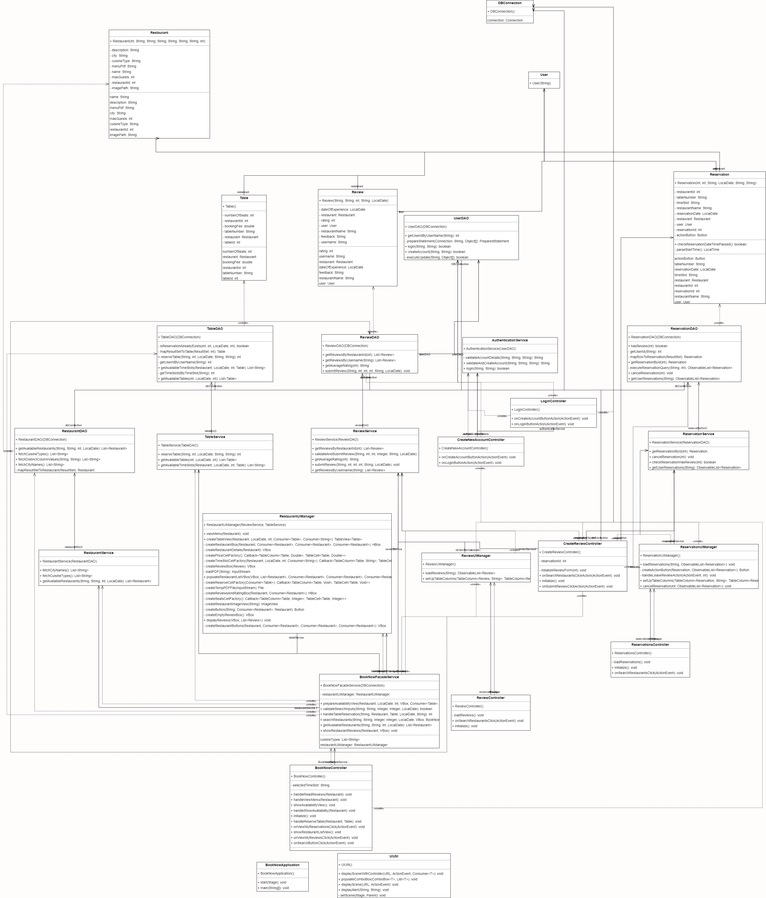

## **Description:**

This class diagram provides an overview of the primary entities involved in the **BookNow** application, including `User`, `Restaurant`, `Reservation`, `Table`, `TimeSlot`, and `Review`. Each 
entity represents a critical component of the system, with key attributes, constructors, and methods designed to facilitate interaction within the system.

### **PLEASE NOTE:**
This is a high-level overview of the attributes, constructors, and methods for each entity. These serve as an initial blueprint and are subject to modification when 
implementing the actual logic. Adjustments, additions, or removals will be made during development, depending on real-world use cases and business logic. The goal 
here is to establish the structural framework, while detailed implementation will evolve as the project progresses. If for any reason you were cross checking and happen to see that the code
is different from what's on here that means a changed happened and have not been updated to architecture.md. 

## **Entities:**

### **1. User**
**Description:** Represents a user of the system, either a customer or a restaurant owner. Users can log in, create reservations, 
and interact with the system.

- **Attributes:**
    - `int userId`: The unique identifier for the user.
    - `String username`: The username chosen by the user.
    - `String password`: The password for user authentication.
    - `String role`: The role of the user, either "customer" or "restaurant."

- **Constructor:**
    - `User(int userId, String username, String password, String role)`: Creates a new `User` object with the specified attributes.

- **Methods:**
    - `getUserId()`: Returns the unique identifier of the user.
    - `setUserId(int userId)`: Sets the user ID.
    - `getUsername()`: Returns the username of the user.
    - `setUsername(String username)`: Sets the username.
    - `getPassword()`: Returns the password of the user.
    - `setPassword(String password)`: Sets the password.
    - `getRole()`: Returns the role of the user (either "customer" or "restaurant").
    - `setRole(String role)`: Sets the role of the user, with validation to ensure it is either "customer" or "restaurant."
    - `toString()`: Returns a string representation of the user object, including the user ID, username, and role.

---

### **2. Restaurant**
**Description:** Represents a restaurant in the system with relevant information such as location, cuisine, and menu.

- **Attributes:**
    - `int restaurantId`: The unique identifier for the restaurant.
    - `String name`: The name of the restaurant.
    - `String city`: The city where the restaurant is located.
    - `String cuisineType`: The type of cuisine the restaurant serves.
    - `String description`: A brief description of the restaurant.
    - `String menuPdf`: The file path to the restaurant's menu in PDF format.
    - `String imagePath`: The file path to the restaurant's image.
    - `int maxGuests`: The maximum number of guests the restaurant can accommodate.

- **Constructor:**
    - `Restaurant(int restaurantId, String name, String city, String cuisineType, String description, String menuPdf, String imagePath, 
int maxGuests)`: Creates a new `Restaurant` object with the specified attributes.

- **Methods:**
    - `getRestaurantId()`: Returns the unique identifier of the restaurant.
    - `setRestaurantId(int restaurantId)`: Sets the restaurant ID.
    - `getName()`: Returns the name of the restaurant.
    - `setName(String name)`: Sets the name of the restaurant.
    - `getCity()`: Returns the city where the restaurant is located.
    - `setCity(String city)`: Sets the city of the restaurant.
    - `getCuisineType()`: Returns the type of cuisine the restaurant serves.
    - `setCuisineType(String cuisineType)`: Sets the type of cuisine.
    - `getDescription()`: Returns the description of the restaurant.
    - `setDescription(String description)`: Sets the description of the restaurant.
    - `getMenuPdf()`: Returns the file path to the restaurant's menu in PDF format.
    - `setMenuPdf(String menuPdf)`: Sets the file path for the menu.
    - `getImagePath()`: Returns the file path to the restaurant's image.
    - `setImagePath(String imagePath)`: Sets the file path for the restaurant's image.
    - `getMaxGuests()`: Returns the maximum number of guests the restaurant can accommodate.
    - `setMaxGuests(int maxGuests)`: Sets the maximum number of guests.

---

### **3. Reservation**
**Description:** Represents a restaurant reservation made by a user for a specific time and table.

- **Attributes:**
    - `int reservationId`: The unique identifier for the reservation.
    - `int restaurantId`: The identifier for the restaurant.
    - `String restaurantName`: The name of the restaurant where the reservation is made.
    - `LocalDate reservationDate`: The date for the reservation.
    - `String timeSlot`: The time slot for the reservation.
    - `String tableNumber`: The table number assigned for the reservation.
    - `Button actionButton`: The action button for managing the reservation (e.g., cancel, view).
    - `User user`: The user who made the reservation.
    - `Restaurant restaurant`: The restaurant associated with the reservation.
    - `TimeSlot timeSlotReserved`: The time slot reserved for the reservation.
    - `Table table`: The table reserved for the booking.

- **Constructor:**
    - `Reservation(int reservationId, int restaurantId, String restaurantName, LocalDate reservationDate, String timeSlot, String tableNumber)`: 
Creates a new `Reservation` object with the specified attributes.

- **Methods:**
    - `getReservationId()`: Returns the unique identifier of the reservation.
    - `setReservationId(int reservationId)`: Sets the reservation ID.
    - `getRestaurantName()`: Returns the name of the restaurant for the reservation.
    - `setRestaurantName(String restaurantName)`: Sets the restaurant name.
    - `getReservationDate()`: Returns the reservation date.
    - `setReservationDate(LocalDate reservationDate)`: Sets the reservation date.
    - `getTimeSlot()`: Returns the time slot for the reservation.
    - `setTimeSlot(String timeSlot)`: Sets the time slot.
    - `getTableNumber()`: Returns the table number.
    - `setTableNumber(String tableNumber)`: Sets the table number.
    - `getTable()`: Returns the reserved table.
    - `setTable(Table table)`: Sets the reserved table.
    - `getActionButton()`: Returns the action button for managing the reservation.
    - `setActionButton(Button actionButton)`: Sets the action button.
    - `getRestaurantId()`: Returns the restaurant ID.
    - `setRestaurantId(int restaurantId)`: Sets the restaurant ID.
    - `getUser()`: Returns the user associated with the reservation.
    - `setUser(User user)`: Sets the user for the reservation.
    - `getRestaurant()`: Returns the restaurant associated with the reservation.
    - `setRestaurant(Restaurant restaurant)`: Sets the restaurant for the reservation.
    - `getTimeSlotReserved()`: Returns the time slot reserved for the reservation.
    - `setTimeSlotReserved(TimeSlot timeSlotReserved)`: Sets the reserved time slot.

---

### **4. Table**
**Description:** Represents a table available for reservation at a restaurant.

- **Attributes:**
    - `int tableId`: The unique identifier for the table.
    - `int restaurantId`: The identifier for the restaurant where the table is located.
    - `String tableNumber`: The table number within the restaurant.
    - `int numberOfSeats`: The number of seats available at the table.
    - `double bookingFee`: The fee required to reserve the table.
    - `boolean isAvailable`: Indicates whether the table is available for reservation.
    - `Restaurant restaurant`: The restaurant associated with the table.

- **Constructor:**
    - `Table()`: Creates a new `Table` object without any parameters.
    - `Table(int tableId, int restaurantId, String tableNumber, int numberOfSeats, double bookingFee, boolean isAvailable)`:
Creates a new `Table` object with the specified attributes.

- **Methods:**
    - `getTableId()`: Returns the unique identifier of the table.
    - `setTableId(int tableId)`: Sets the unique identifier of the table.
    - `getRestaurantId()`: Returns the restaurant ID where the table is located.
    - `setRestaurantId(int restaurantId)`: Sets the restaurant ID for the table.
    - `getTableNumber()`: Returns the table number.
    - `setTableNumber(String tableNumber)`: Sets the table number.
    - `getNumberOfSeats()`: Returns the number of seats at the table.
    - `setNumberOfSeats(int numberOfSeats)`: Sets the number of seats at the table.
    - `getBookingFee()`: Returns the booking fee.
    - `setBookingFee(double bookingFee)`: Sets the booking fee for the table.
    - `isAvailable()`: Returns whether the table is available for reservation.
    - `setAvailable(boolean available)`: Sets the availability of the table.
    - `getRestaurant()`: Returns the restaurant associated with the table.
    - `setRestaurant(Restaurant restaurant)`: Sets the restaurant associated with the table.

---

### **5. TimeSlot**
**Description:** Represents a time slot available for restaurant reservations.

- **Attributes:**
    - `int slotId`: The unique identifier for the time slot.
    - `String slotLabel`: The label describing the time slot (e.g., "9:00 AM - 10:00 AM").

- **Constructor:**
    - `TimeSlot()`: Creates a new `TimeSlot` object without any parameters.
    - `TimeSlot(int slotId, String slotLabel)`: Creates a new `TimeSlot` object with the specified `slotId` and `slotLabel`.

- **Methods:**
    - `getSlotId()`: Returns the unique identifier of the time slot.
    - `setSlotId(int slotId)`: Sets the unique identifier of the time slot.
    - `getSlotLabel()`: Returns the label of the time slot.
    - `setSlotLabel(String slotLabel)`: Sets the label for the time slot.
    - `toString()`: Returns a string representation of the `TimeSlot`, showing the `slotId` and `slotLabel`.

---

### **6. Review**
**Description:** Represents a review left by a customer for a restaurant.
- **Attributes:**
    - `int reviewId`: The unique identifier for the review.
    - `String username`: The username of the user leaving the review.
    - `String restaurantName`: The name of the restaurant being reviewed.
    - `int rating`: The rating given to the restaurant.
    - `String feedback`: The review comments.
    - `LocalDate dateOfExperience`: The date when the customer experienced the restaurant.
    - `User user`: The user who left the review.
    - `Restaurant restaurant`: The restaurant being reviewed.
    - `TimeSlot timeSlotReserved`: The time slot during which the review is associated.
    - `Reservation reservation`: The reservation associated with the review.

- **Constructor:**
    - `Review(int reviewId, String username, String restaurantName, int rating, String feedback, LocalDate dateOfExperience)`: 
Creates a new `Review` object with the given attributes.

- **Methods:**
    - `getReviewId()`: Returns the unique identifier of the review.
    - `setReviewId(int reviewId)`: Sets the review ID.
    - `getUsername()`: Returns the username of the reviewer.
    - `setUsername(String username)`: Sets the username.
    - `getRestaurantName()`: Returns the name of the restaurant being reviewed.
    - `setRestaurantName(String restaurantName)`: Sets the restaurant name.
    - `getRating()`: Returns the rating of the restaurant.
    - `setRating(int rating)`: Sets the rating.
    - `getFeedback()`: Returns the review comments.
    - `setFeedback(String feedback)`: Sets the review comments.
    - `getDateOfExperience()`: Returns the date of the experience.
    - `setDateOfExperience(LocalDate dateOfExperience)`: Sets the experience date.
    - `getUser()`: Returns the user who left the review.
    - `setUser(User user)`: Sets the user who left the review.
    - `getRestaurant()`: Returns the restaurant being reviewed.
    - `setRestaurant(Restaurant restaurant)`: Sets the restaurant being reviewed.
    - `getTimeSlotReserved()`: Returns the time slot reserved.
    - `setTimeSlotReserved(TimeSlot timeSlotReserved)`: Sets the time slot reserved.
    - `getReservation()`: Returns the reservation associated with the review.
    - `setReservation(Reservation reservation)`: Sets the reservation associated with the review.
  

# Class Diagram 2: Reservation System (MVC Architecture)

**Model-View-Controller (MVC)** architecture. The system is structured with three primary layers: **Models**, **Views**, and **Controllers**.

### **Models**:
The **Model** layer represents the core entities of the system. 
 - Model is already in Diagram 1

### **Views**:
The **View** layer consists of the user interface (UI) for interacting with the system. These are defined using JavaFX and FXML files:
- **LoginView**: The UI for users to log in.
- **CreateAccountView**: The UI for new users to create an account.
- **BookNowView**: The main UI where users search for restaurants and create reservations.
- **ReservationView**: The UI where users can view their reservation's. (Will Implement Soon)
- **ReviewView** The UI where users can view their reviews made. (Will Implement Soon)

### **Controllers:**
The **Controller** layer acts as the intermediary between the UI (view) and the backend logic (models).

# **BookNowController**
The `BookNowController` is responsible for handling user input, interacting with the database, and updating 
the UI with the results of the restaurant search.

## **Fields**:

### **UI Elements**:
- `Label lbl_welcome`: Displays a welcome message, greeting the user by their username.
- `ComboBox<String> locationComboBox`: A dropdown menu for users to select a restaurant location (city).
- `ComboBox<String> cb_cuisineType`: A dropdown menu for users to select the type of cuisine (e.g., Fast Food, BBQ).
- `DatePicker checkInDate`: A date picker for users to select a reservation date.
- `VBox restaurantListVBox`: A vertical box that will be populated with restaurant results based on the user's search.
- `ComboBox<Integer> cb_adults`: A dropdown menu for user to selecting the number of adults for the reservation.
- `ComboBox<Integer> cb_children`: A dropdown menu for selecting the number of children for the reservation.

### **Database Handler**:
- `DBConnection dbHandler`: An instance of the `DBConnection` class responsible for interacting with the database to fetch city names, cuisine types, and available restaurants.

### **Selected Fields**:
- `String selectedCity`: Holds the value of the selected city from `locationComboBox`.
- `String selectedCuisineType`: Holds the value of the selected cuisine type from `cb_cuisineType`.
- `LocalDate selectedDate`: Holds the date selected by the user in `checkInDate`.

## **Constructor**:
- `public BookNowController()`:
  - Initializes the `BookNowController` class.
  - Creates an instance of `DBConnection` to handle interactions with the database.

## **Methods**:

### **initialize()**:
- **Purpose**: This method is called when the controller is initialized. It sets up the UI components by populating the city and cuisine type combo boxes.
- **Key Steps**:
  - Displays a welcome message for the current user.
  - Fetches city names and cuisine types from the database and populates the relevant dropdowns.
  - Populates the `locationComboBox`, `cb_cuisineType` , `cb_adults`, `cb_children` dropdowns with the fetched values.

### **onSearchButtonClick(ActionEvent event)**:
- **Purpose**: Handles the search button click event, triggering the search for restaurants based on the selected city, cuisine type, and date.
- **Key Steps**:
  - Retrieves the user selections for city, cuisine type, and date.
  - Validates the inputs to ensure all required fields are filled and that the date is not in the past.
  - Fetches the list of available restaurants from the database using the selected criteria.
  - Populates the `restaurantListVBox` with the restaurant details.

### **populateRestaurantListVBox(List<Restaurant> restaurants)**:
- **Purpose**: Populates the `VBox` with a list of restaurant details.
- **Key Steps**:
  - Clears existing entries in the `restaurantListVBox`.
  - For each restaurant in the list, creates a new `VBox` containing the restaurant's name, city, and description.
  - Adds each restaurant box to the `restaurantListVBox`.

# **CreateNewAccountController**

The **Controller** layer acts as the intermediary between the UI (view) and the backend logic (models). The `CreateNewAccountController` is responsible for handling user input during account creation, interacting with the database to create new users, and updating the view with feedback for the user.

## **Fields**:

### **UI Elements**:
- `TextField tf_Username`: Input field for the username the user wants to create.
- `PasswordField pf_Password`: Input field for the user's password.
- `PasswordField pf_ConfirmPassword`: Input field for confirming the user's password.

### **Database Handler**:
- `DBConnection dbHandler`: An instance of the `DBConnection` class responsible for interacting with the database to check if a username already exists and to create a new user account.

## **Constructor**:
- `public CreateNewAccountController()`:
  - Initializes the `CreateNewAccountController` class.
  - Creates an instance of `DBConnection` to handle interactions with the database.

## **Methods**:

### **onCreateAccountButtonAction(ActionEvent event)**:
- **Purpose**: Handles the "Create Account" button click event, performing the logic for creating a new user account.
- **Key Steps**:
  - Retrieves the user's input from the username, password, and confirm password fields.
  - Validates that all fields are filled and that the password matches the confirmation password.
  - Checks the database to ensure the username is not already taken.
  - If the username is available, creates the new account and displays a success message, redirecting the user to the login page.
  - If an error occurs (e.g., username already exists), displays an error message in an alert.

### **onButton_Login(ActionEvent event)**:
- **Purpose**: Handles the "Log In" button click event, redirecting the user to the login page.
- **Key Steps**:
  - Calls the `Util.displayScene` method to load the `LoginView.fxml` page for the user to login.

# **LoginController**

The **LoginController** is responsible for handling user authentication. It manages user input during login, interacts with the database to verify credentials, and updates the view based on the login outcome. It also provides navigation to the account creation page.

## **Fields**:

### **UI Elements**:
- `TextField tf_Username`: Input field for the username entered by the user.
- `PasswordField pf_Password`: Input field for the user's password.

### **Database Handler**:
- `DBConnection dbHandler`: An instance of the `DBConnection` class responsible for interacting with the database to verify login credentials.

## **Constructor**:
- `public LoginController()`:
  - Initializes the `LoginController` class.
  - Creates an instance of `DBConnection` to handle interactions with the database.
 
## **Methods**:

### **onLoginButtonAction(ActionEvent event)**:
- **Purpose**: Handles the "Login" button click event. This method validates user input, checks login credentials against the database, and redirects to the main application page on successful login.
- **Key Steps**:
  - Retrieves the username and password entered by the user.
  - Validates that both fields are filled.
  - Interacts with `DBConnection` to verify if the username and password are correct.
  - If the credentials are valid, it sets the global user and redirects to the main application (`BookNowView`).
  - If login fails, it displays an error message using an alert dialog..

### **onCreateAccountButtonAction(ActionEvent event)**:
- **Purpose**: Handles the "Create Account" button click event. This method redirects the user to the account creation page when the "Create Account" button is clicked.
- **Key Steps**:
  - Calls the `Util.displayScene` method to load the `CreateAccountView.fxml` page, which is the user interface for account creation.

### Diagram:

# Interaction Flow

---

### Example: Interaction Flow

## **1. User Login Interaction Flow**

1. **User Input:**
  - The user enters their **username** and **password** in the login form, which is handled by the `LoginController`.

2. **Login Button Click:**
  - The user clicks the "Login" button, triggering the `onLoginButtonAction()` method in the `LoginController`.
  - The method validates that both fields (username and password) are filled in.

3. **Database Check:**
  - The `LoginController` calls `DBConnection.login(username, password)` to check the credentials against the database.

4. **Success Scenario:**
  - If the login is successful:
    - The `LoginController` sets the global `Util.USER` variable to the logged-in username.
    - It then calls the `Util.displayScene()` method to load the `BookNowView.fxml` scene, which contains the restaurant search interface.

5. **Failure Scenario:**
  - If the login fails, an error message is displayed to the user using the `Util.displayAlert()` method.

---

## **2. Search for Restaurants Interaction Flow**

1. **User Input:**
  - The user selects a **city**, **cuisine type**, and a **date** in the search form provided in `BookNowView.fxml`. This is handled by the `BookNowController`.

2. **Search Button Click:**
  - The user clicks the "Search" button, triggering the `onSearchButtonClick()` method in the `BookNowController`.
  - The method validates the user input to ensure that all fields are filled correctly (city, cuisine type, and date).

3. **Database Query:**
  - The `BookNowController` calls the `DBConnection.getAvailableRestaurants(selectedCity, selectedCuisineType, selectedDate)` method to fetch the list of restaurants that match the search criteria from the database.

4. **Display Results:**
  - The database query results are passed back to the `BookNowController`.
  - The `populateRestaurantListVBox()` method is called to dynamically create a list of restaurants using JavaFX components.
  - Each restaurant is displayed in the interface within a `VBox`, which shows the restaurant's name, city, and description.

---

## **3. Utility Interaction Flow**

1. **Scene Switching:**
  - When scenes need to be switched (e.g., after login or after account creation), the `Util.displayScene()` method is called by the appropriate controller (`LoginController` or `CreateNewAccountController`).
  - This method loads the new FXML view and ensures that the current window size and maximization state are preserved.

2. **Alerts and Messages:**
  - If any validation errors occur (e.g., during login, account creation, or restaurant search), the `Util.displayAlert()` method is used to display an alert with the appropriate message to the user.

# **Adherence to MVC Principles**

The BookNow application follows the **Model-View-Controller (MVC)** architecture pattern to maintain separation of concerns. This design ensures a modular and maintainable code structure by dividing the application into three interconnected layers: **Models**, **Views**, and **Controllers**. Below is an analysis of how the application adheres to the MVC principles based on the provided code.

---

## **1. Models:**
The **Model** layer represents the core entities and data of the application, along with the logic required to interact with the data.

### **Entities:**
- `User`: Represents a user of the system (either a customer or a restaurant owner), with fields for user ID, username, password, and role.
- `Restaurant`: Represents a restaurant with attributes such as name, city, cuisine type, description, maxGuests, and more.
- `Reservation`: Represents a reservation at a restaurant with fields for reservation ID, restaurant ID, date, time slot, and table number.
- `Review`: Represents a review given by a user for a restaurant, including fields for review ID, rating, feedback, and date of experience.
- `Table`: Represents a table at a restaurant with fields for table ID, restaurant ID, number of seats, and availability.
- `TimeSlot`: Represents available time slots for a reservation.

### **Data Logic:**
- The `DBConnection` class is responsible for handling all interactions with the database, such as verifying user login credentials, creating new accounts, and fetching restaurant data based on search criteria.
- This ensures that the data layer is independent of the UI, and the controller interacts with the model through `DBConnection`.

### **Strengths in the Model Layer:**
- **Low Coupling**: The model is decoupled from the view and controller. Data is handled in the `DBConnection` class, ensuring that the logic to interact with the database is separated from the user interface and control flow.

---

## **2. Views:**
The **View** layer is responsible for displaying the UI to the user and is defined using **JavaFX** FXML files.

### **Key Views:**
- **LoginView.fxml**: Displays the login interface where the user enters their credentials.
- **BookNowView.fxml**: Provides the restaurant search interface with options to select location, cuisine type, and date.
- **CreateAccountView.fxml**: Provides the interface for users to create a new account.
- **Other Views**: Additional FXML files exist to handle other functionalities such as viewing reservations and reviews.

### **Strengths in the View Layer:**
- **Cohesion**: The view layer is solely responsible for rendering the user interface and capturing user input. No business logic is embedded within the view files.
- **Modular UI**: Each screen (login, account creation, restaurant search) is separated into different FXML files, promoting high cohesion within the view layer and making the UI easier to maintain.

---

## **3. Controllers:**
The **Controller** layer acts as the intermediary between the models and views. Each controller listens to events in the user interface, interacts with the model, and updates the view accordingly.

### **Controllers in the Application:**
- **LoginController**:
  - Handles user login functionality.
  - Uses the `DBConnection.login()` method to check user credentials.
  - Switches to the `BookNowView.fxml` screen if the login is successful, or displays an error using the `Util.displayAlert()` method if login fails.

- **BookNowController**:
  - Manages the restaurant search functionality.
  - Validates user input (city, cuisine type, and date) and interacts with the model (`DBConnection.getAvailableRestaurants()`) to retrieve relevant data.
  - Populates the restaurant list in the UI using the `populateRestaurantListVBox()` method.

- **CreateNewAccountController**:
  - Handles the creation of new user accounts.
  - Uses the `DBConnection.createAccount()` method to insert a new user into the database.
  - Displays alerts for success or failure and redirects the user to the login screen upon successful account creation.

### **Strengths in the Controller Layer:**
- **Controller Interactions with Models**: Controllers interact with the `DBConnection` class to retrieve and modify data, adhering to MVC principles by separating the data logic from the controller.
- **Validation Logic**: Controllers handle user input validation before sending data to the model, ensuring that invalid data is not passed to the database.
- **Scene Management**: Controllers handle scene transitions using `Util.displayScene()` to switch between views, maintaining separation between the UI and control logic.

---

## **4. Communication Between Layers:**

- **From View to Controller**:
  - User interactions such as button clicks (e.g., login or search) trigger event handlers defined in the controller classes. For example, the `onLoginButtonAction()` method in `LoginController` is triggered when the login button is clicked.

- **From Controller to Model**:
  - Controllers interact with the model by calling methods in the `DBConnection` class to fetch or modify data. For example, `DBConnection.login()` is called from the `LoginController` to check user credentials.

- **From Controller to View**:
  - Once the controller receives data from the model, it updates the view accordingly. For instance, the `BookNowController` populates the restaurant list in the view after fetching the search results.

---

## **Key Principles Followed:**

1. **High Cohesion**:
  - Each class and layer has a well-defined responsibility. Views handle UI rendering, controllers manage logic and interaction between layers, and models handle data.

2. **Low Coupling**:
  - The layers are kept separate, allowing for independent development and maintenance. For instance, the controller only knows about the `DBConnection` class, not the underlying database schema, while the views are unaware of the data source.

3. **Layered Communication**:
  - Data flows from the user (via the view), through the controller, to the model, and then back to the view. This clear communication flow ensures that data and presentation logic are decoupled.

---
# Sequence Diagram for Customer Login and Restaurant Search

## **Overview:**

This sequence diagram illustrates the interaction between the **View**, **Controller**, and **Model** layers in the `BookNow` application during two primary use cases:
1. **Customer Login**: A customer logs into the application.
2. **Restaurant Search**: After logging in, the customer searches for available restaurants based on location, cuisine type, and date.

The diagram follows the **Model-View-Controller (MVC)** pattern and demonstrates how user inputs from the view are passed to the controller, processed in the model, and how the resulting data is returned to the view.

---

## **Actors Involved:**
- **Customer**: The user who interacts with the system.
- **View Layer (JavaFX)**:
  - **LoginView**: The login interface presented to the customer.
  - **BookNowView**: The search interface for finding restaurants.
- **Controller Layer**:
  - **LoginController**: Handles user login events.
  - **BookNowController**: Handles restaurant search events.
- **Model Layer**:
  - **DBConnection**: Interacts with the database to verify login credentials and fetch restaurant details.

---

## **Login Use Case Sequence:**
1. **Customer enters username and password** in the `LoginView`.
2. The **LoginController** calls the `login()` method from the **DBConnection** class to check the database for matching credentials.
3. The **DBConnection** class executes a SQL query to verify the login credentials.
4. The result (success or failure) is returned to the **LoginController**.
5. If successful:
  - The **LoginController** updates the current user by calling `Util.setCurrentUser(username)`.
  - The **LoginController** calls `Util.displayScene()` to transition the view to the **BookNowView** (restaurant search interface).
6. If login fails, an error message is displayed to the customer via `Util.displayAlert()`.

---

## **Restaurant Search Use Case Sequence:**
1. **Customer selects location, cuisine type, and date** from the dropdowns and date picker in the `BookNowView`.
2. The **BookNowController** validates the input to ensure all fields are properly filled out. If any validation fails, it calls `Util.displayAlert()` to inform the user.
3. If validation passes, the **BookNowController** calls the `getAvailableRestaurants()` method from the **DBConnection** class to fetch matching restaurants.
4. The **DBConnection** class executes a SQL query to retrieve the restaurants based on the selected city, cuisine type, and date.
5. The list of available restaurants is returned to the **BookNowController**.
6. The **BookNowController** populates the `VBox` in the **BookNowView** with restaurant details such as name, city, and description using the `populateRestaurantListVBox()` method.

---

## **Sequence Diagram:**

## **Final Diagram:**

This class diagram illustrates the **MVC architecture** of the BookNow system, with a clear separation between models, views, and controllers. It highlights the following key aspects:

- **Controllers**: The controllers manage the flow of data between the views (the user interface) and the models (the core business entities). They handle user interactions, process inputs, and retrieve data from the models to update the views.

- **Models**: The models represent the core entities of the system, such as `User`, `Restaurant`, `Reservation`, `Table`, `TimeSlot`, and `Review`. These entities are central to the system's functionality, but in this diagram, their attributes and methods are intentionally left out for simplicity.

- **Views**: The views represent the user interface components where users interact with the system, such as `LoginPage`, `BookNowPage`, and `ReservationsPage`. These views communicate with the controllers to update and display the relevant data.

- **DBConnection**: All interactions with the database are centralized in the `DBConnection` class. This design ensures that the controllers focus on managing the application's logic, while the database handler takes care of all database-related operations, such as querying, updating, and fetching data.

### **Note**:
- The diagram does not include fields, methods, or detailed attributes because, when building a large application, changes are often required. Keeping this high-level structure blank allows for flexibility in development and avoids locking down implementation details too early as you know.
