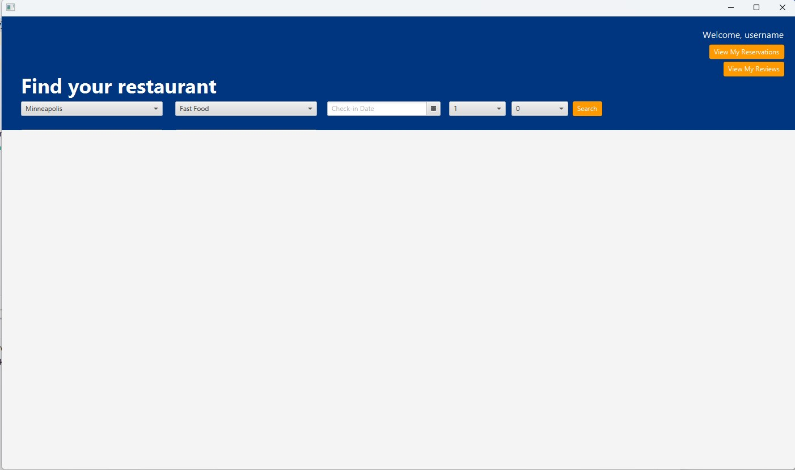

## Wireframes

### 1. **BookNow Login Wireframe**

**Description**:  
This is the login screen that users first see when they open the application. It includes:
- A large "BookNow" title with a tagline "Discover and reserve tables at the best restaurants."
- A form on the right with fields to enter:
    - Username
    - Password
- Three buttons/links:
    - "Login" to submit the entered credentials.
    - "Forgot Password?" link for users who have forgotten their password (will be non-functional just for looks).
    - "Create New Account" button to navigate to the account creation screen.

### 2. **BookNow Create New Account Wireframe**

**Description**:  
This screen allows new users to create an account in the BookNow system. It includes:
- A large "BookNow" title with the tagline "Create an account to reserve tables at the best restaurants."
- On the right, there is a form for account creation with fields:
    - Username
    - Password
    - Confirm Password
- Text:
    - Already have an account?
- Two buttons:
    - "Create New Account" to submit the form and create a new user.
    - "Log in" which takes users back to the login screen if they already have an account.

---

### 3. **BookNow Dashboard Wireframe**

**Description**:  
This is the main dashboard screen where users can search for restaurants. It has the following features:
- A welcome message at the top center, showing "Welcome, User."
- Two buttons:
    - "View My Reservations" to see current bookings.
    - "View My Reviews" to check the reviews left by the user.
- A search interface below the buttons, with options to:
    - Select a Location from a dropdown.
    - Choose a Cuisine Type from a dropdown.
    - Pick a Check-in Date using a date picker.
    - Specify the number of Adults and Children using dropdown menus.
- A "Search" button to trigger the search based on the selected criteria.
- The screen layout has an upper blue section for filters and options and a white lower section for displaying search results.

---

-- Implement soon
### 4. **BookNow Reservations Wireframe**

**Description**:  
This screen allows users to view their current reservations. It includes:
- A header with the label "Your Reservations" in large text on the left.
- A button labeled "Search Restaurants" on the right for users to search for restaurants.
- A table with the following columns:
    - Restaurant Name
    - Reservation Date
    - Time Slot
    - Table Number
    - Action (for managing reservations such as canceling).
- If table is currently empty a placeholder text "No content in table."

### 5. **BookNow Reviews Wireframe**

**Description**:  
This screen displays a list of reviews left by the user for restaurants they have visited. It includes:
- A header with "Your Reviews" displayed prominently, and a button labeled "Search Restaurants" on the right for searching restaurants.
- A table with columns to display:
    - Restaurant Name
    - Date of Experience
    - Rating (numerical or star-based system)
    - Review (textual content written by the user).
- The table is currently empty with a placeholder text "No content in table."

---

