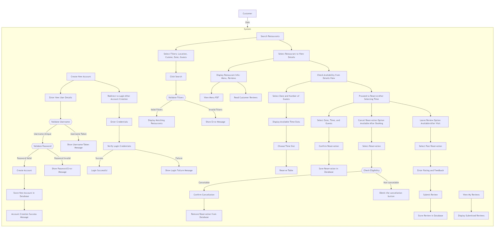

# Requirements

## Use Case Diagram

## Non-Functional Requirements

### Performance
- **Explanation**: The application should quickly return search results and manage user inputs without delay.
- **Implementation**:
    1. Implement database indexing.
    2. Optimize SQL queries to speed up the search for restaurants based on location, cuisine type, and other filters.

### Maintainability
- **Explanation**: The system should be easy to maintain and update, with clear documentation, modular design, and an understandable code structure. This will allow future developers or maintainers to easily comprehend the system and make necessary changes or improvements without significant difficulty.
- **Implementation**:
  1. Ensure the project is well-documented, with clear explanations of how the code works, setup instructions, and how to modify or extend the system.
  3. Use standard coding practices, including meaningful naming conventions and appropriate commenting, to improve readability and long-term maintainability.
  4. Regularly review and refactor the code to remove technical debt and ensure consistency across the codebase.

### Usability
- **Explanation**: The interface will be intuitive and user-friendly, enabling users to quickly navigate the application.
- **Implementation**:
    1. Create a clean, minimalist design.
    2. Add helpful tooltips.
    3. Implement responsive error handling.
    4. Provide user feedback mechanisms.

## Functional Requirements

# Use Case 1: User Authentication

## Actors
- **New User**
- **Existing User**

## Use Case Goal
Enable users to create new accounts and log in to access the application.

## Primary Actor
**User**

## Preconditions
- **New Users:** Should not already be registered in the system.
- **Existing Users:** Must have valid credentials.

## Basic Flow

### New User

1. The user enters a username, password, and confirm password in the `CreateNewAccountController` form.
2. `CreateNewAccountController` calls `UserService.validateAndCreateAccount()` to validate the inputs:
  - Ensures the username is at least 8 characters long.
  - Checks that the password matches the confirmation password and is at least 8 characters long.
  - Uses `UserDAO.login()` to check if the username already exists in the database.
3. If inputs are valid:
  - The system creates a new account with `UserDAO.createAccount()` through `UserService`.
  - After successful account creation, the `CreateNewAccountController`:
    - Sets the global `UIUtil.USER` variable to the new username.
    - Redirects the user to the `BookNowView`.

### Existing User

1. The user enters their username and password in the `LoginController`.
2. `LoginController` validates credentials by calling `UserService.login()`, which:
  - Checks that both the username and password fields are filled.
  - Verifies credentials against the database using `UserDAO.login()`.
3. If valid:
  - `LoginController` sets `UIUtil.USER` to the username.
  - The system redirects the user to `BookNowView`.

## Alternative Flows

### Alternative Flow 1: Mismatched Passwords During Account Creation
- `CreateNewAccountController` displays an error using `UIUtil.displayAlert()` to prompt the user to correct the input.

### Alternative Flow 2: Username is Already Taken When Creating an Account
- `CreateNewAccountController` uses `UIUtil.displayAlert()` to inform the user and prompt for a different username.

### Alternative Flow 3: Invalid Credentials During Login
- `LoginController` displays an error message with `UIUtil.displayAlert()` to inform the user of incorrect credentials.
---
# Use Case 2: Search Restaurants

## Actors
- **Customer**

## Use Case Goal
Allow customers to search for restaurants based on location, cuisine type, reservation date, and number of guests.

## Primary Actor
**Customer**

## Preconditions
Restaurants must be registered in the database.

## Basic Flow

### Navigate to Search Page
- The customer navigates to the search page, which is managed by `BookNowController`.

### Filter Selection
- The customer selects filters for the search:
  - **Location:** Chosen from a dropdown populated by `BookNowController` using `RestaurantServices.getCityNames()`.
  - **Cuisine Type:** Chosen from a dropdown populated by `RestaurantServices.getCuisineTypes()`.
  - **Date:** Selected using a date picker (`checkInDate`), with validation to ensure the date is not earlier than the current date.
  - **Number of Guests:** Selected using two dropdowns (`cb_adults` and `cb_children`) for adults and children, populated using `IntStream`.

### Initiate Search
- The customer clicks the Search button.
- `BookNowController`’s `onSearchButtonClick()` method handles the search by gathering the selected filters and validating them.

### Input Validation
- The `BookNowController` calls `BookNowFacadeService.validateSearchInputs()` to ensure that:
  - **Location and Cuisine Type fields are not empty.**
  - **Date is valid** (not in the past).
  - **Adults and Children counts are provided**, with at least one adult.

### Retrieve and Display Results
- If validation succeeds:
  - `BookNowFacadeService.searchRestaurants()` is called, which in turn calls `RestaurantServices.getAvailableRestaurants()` and `RestaurantDAO.getAvailableRestaurants()`.
  - Matching restaurants are retrieved from the database.
  - `RestaurantUIManager.populateRestaurantListVBox()` is called to dynamically create and display a list of restaurants within the UI’s `VBox` (`restaurantListVBox`).

## Alternative Flows

### Alternative Flow 1: No Matching Restaurants
- If no restaurants match the selected filters, an alert is displayed using `UIUtil.displayAlert()` to inform the user that no restaurants are available.

### Alternative Flow 2: Missing or Invalid Input
- If any required input is missing or invalid, an alert is displayed via `UIUtil.displayAlert()` indicating the specific missing or invalid field (e.g., missing location or date).
---

# Use Case 3: View Restaurant Details

## Actors
- **Customer**

## Use Case Goal
Allow users to view detailed information about a selected restaurant.

## Primary Actor
**Customer**

## Preconditions
The restaurant must be registered in the database.

## Basic Flow

### Select Restaurant
- The customer selects a restaurant from the search results displayed on the main search page managed by `BookNowController`.
- This selection triggers the `BookNowController` to handle the restaurant details request.

### Display Restaurant Information
- The system, through `BookNowController`, gathers detailed information about the selected restaurant by calling:
  - `RestaurantUIManager.viewMenu(restaurant)`: Displays the restaurant’s menu in a PDF format using the system’s default PDF viewer. The PDF is retrieved by `RestaurantUIManager.loadPDF()` based on the restaurant's specified menu file path.
  - `BookNowController.handleReadReviews(restaurant)`: Retrieves customer reviews for the restaurant by calling `ReviewService.getReviewsByRestaurantId()` and displays them using `RestaurantUIManager.displayReviews()` in the `reviewsOverlay` `VBox`.
  - Additional details such as restaurant name, location, and description are also displayed in `BookNowController`'s UI layout.

## Alternative Flows

### Alternative Flow 1: Missing Restaurant Information
- If the selected restaurant lacks specific information (e.g., no menu PDF or reviews), the system handles this gracefully:
  - **Menu Not Found:** If `viewMenu()` cannot locate the menu file, `UIUtil.displayAlert()` is triggered to notify the customer that the menu is unavailable.
  - **No Reviews:** If `getReviewsByRestaurantId()` finds no reviews, an empty message is displayed in `reviewsOverlay` via `RestaurantUIManager.displayReviews()`.

# Use Case 4: Check Table Availability

## Actors
- **Customer**

## Use Case Goal
Allow customers to select a reservation time for a chosen restaurant.

## Primary Actor
**Customer**

## Preconditions
Customer must be logged in, and the system must have access to restaurant availability data.

## Basic Flow

### Select Restaurant and View Availability
- The customer selects a restaurant from the search results.
- The `BookNowController` calls `handleShowAvailability(restaurant)`, which:
  - Retrieves the selected date from `DatePicker` and guest count from `ComboBox` components.
  - Calls `BookNowFacadeService.showAvailability()` to display available tables for the selected restaurant, date, and guest count.

### Display Available Tables and Time Slots
- `BookNowFacadeService.showAvailability()`:
  - Hides the restaurant list view and displays `availabilityVBox`.
  - Retrieves available tables from `TableService.getAvailableTables()` and populates a `TableView` with table options, using `RestaurantUIManager.createTableView()` to allow time slot selection.
  - The customer can select a time slot from a `ComboBox` within the `TableView` row, dynamically populated by `TableService.getAvailableTimeSlots()` based on the selected date and guest count.

### Confirm Reservation
- After selecting a time slot, the customer clicks "Reserve" for a table, which:
  - Triggers `BookNowController.handleReserveTable()`, calling `TableService.reserveTable()` to save the reservation in the database.
  - The system displays a confirmation message using `UIUtil.displayAlert()` to confirm the reservation.

## Alternative Flows

### Alternative Flow 1: Customer Cancels Reservation Process
- If the customer decides not to complete the reservation, they can click "Back" to return to the restaurant list view by calling `BookNowController.showRestaurantListView()`.

### Alternative Flow 2: Selected Time Slot Unavailable
- If the selected time slot becomes unavailable (e.g., due to another booking), `TableService.getAvailableTimeSlots()` retrieves the updated list of time slots, and the `RestaurantUIManager.createTableView()` updates the `ComboBox` to show only available options. The system may display an alert using `UIUtil.displayAlert()` to notify the customer of the change.
---

# Use Case 5: Make a Reservation

## Actors
- **Customer**

## Use Case Goal
Enable customers to make a reservation at a restaurant.

## Primary Actor
**Customer**

## Preconditions
Customer must be logged in and have selected a restaurant with available tables.

## Basic Flow

### Select Restaurant and Reservation Details
- The customer selects a restaurant from the search results.
- `BookNowController` retrieves reservation options by:
  - Displaying the available tables, guest count, and reservation dates.
  - Populating time slots using `TableService.getAvailableTimeSlots()` through `RestaurantUIManager` components, allowing customers to select a time slot and table number.

### Initiate Reservation
- The customer selects a time slot and clicks the "Reserve" button for a specific table.
- `BookNowController.handleReserveTable()` is called, invoking `TableService.reserveTable()` to create a reservation:
  - Passes reservation details such as username, restaurantId, selected date, time slot, and table number to `TableService`.
  - `TableService` confirms the reservation by saving it in the database through `TableDAO.reserveTable()`.

### Confirmation
- Upon successful reservation, the system displays a confirmation message using `UIUtil.displayAlert("Reservation Confirmed")`.
- The reservation details, including restaurant name, reservation date, and time, are shown to the customer for reference.

## Alternative Flows

### Alternative Flow 1: Customer Cancels Reservation Process
- If the customer decides not to proceed, they can cancel the process by clicking "Back," which returns them to the restaurant search page via `BookNowController.showRestaurantListView()`.

### Alternative Flow 2: Selected Table or Time Slot Unavailable
- If the selected table or time slot becomes unavailable during the reservation process:
  - `TableService.getAvailableTables()` retrieves the updated availability, and the `RestaurantUIManager.createTableView()` updates the display.
  - The system may notify the customer using `UIUtil.displayAlert("Selected slot is unavailable. Please select a different time.")`.

# Use Case 6: Cancel a Reservation

## Actors
- **Customer**

## Use Case Goal
Enable customers to cancel an existing reservation.

## Primary Actor
**Customer**

## Preconditions
- Customer must be logged in.
- A valid, non-expired reservation exists.

## Basic Flow

### View Reservations
- The customer navigates to their reservations using `BookNowController.showMyReservationsView()`.
- `ReservationsController` retrieves the list of reservations through `ReservationService.getUserReservations()`, which in turn calls `ReservationDAO.getUserReservations()` to fetch data from the database.

### Select Reservation to Cancel
- The system displays a list of reservations, each with a “Cancel Reservation” button if the reservation is eligible for cancellation.
- The customer selects a reservation to cancel by clicking the "Cancel Reservation" button associated with that reservation.

### Confirm Cancellation
- Upon clicking "Cancel Reservation," `ReservationUIManager.cancelReservation()` calls `ReservationService.cancelReservation()` to delete the reservation from the database using `ReservationDAO.cancelReservation()`.
- The reservation is then removed from the displayed list to reflect the cancellation.

### Cancellation Feedback
- The system confirms the successful cancellation with a message via `UIUtil.displayAlert("Reservation Canceled", "Your reservation has been successfully canceled.")`.

## Alternative Flows

### Alternative Flow 1: Reservation Not Eligible for Cancellation
- If the customer attempts to cancel a reservation within a restricted time period (e.g., less than 24 hours in advance), the "Cancel Reservation" button is disabled.
- A message is displayed using `UIUtil.displayAlert("Cancellation Unavailable", "Reservations cannot be canceled within 24 hours of the reservation time.").
---
# Use Case 7: Leave a Review

## Actors
- **Customer**

## Use Case Goal
Enable customers to leave reviews for restaurants they have visited.

## Primary Actor
**Customer**

## Preconditions
- Customer must have completed a past reservation for the restaurant.
- The reservation is eligible for review, meaning the reservation date has passed, and no review has been previously submitted.

## Basic Flow

### View Reservations
- The customer navigates to their reservations list in `ReservationsController`, which displays each past reservation.
- Eligible reservations for review show a "Leave a Review" button, while those already reviewed display "View Your Review."

### Select Reservation to Review
- The customer clicks "Leave a Review" on an eligible reservation.
- The system, through `ReservationUIManager`, opens the review submission view via `UIUtil.displaySceneWithController()` and passes the reservation ID to `CreateReviewController`.

### Submit Review
- `CreateReviewController` populates the restaurant and reservation details for the review form.
- The customer enters their rating (1-5) and feedback in the form.
- Upon submission, `CreateReviewController.onSubmitReviewClickAction()` calls `ReviewService.validateAndSubmitReview()`, which:
  - Validates that a rating is selected and feedback is provided.
  - Calls `ReviewDAO.submitReview()` to save the review in the database.

### Confirmation Feedback
- The system displays a success message confirming the review submission using `UIUtil.displayAlert("Success", "Review successfully submitted!")`.

## Alternative Flows

### Alternative Flow 1: Missing Review Input
- If the customer submits without providing a rating or feedback, `ReviewService.validateAndSubmitReview()` returns an error message.
- `UIUtil.displayAlert()` displays an alert prompting the customer to complete the required fields.

### Alternative Flow 2: Reservation Not Eligible for Review
- If the reservation is not eligible for review (e.g., the date has not yet passed or a review already exists), the "Leave a Review" button is disabled in the reservation list.
- The system displays "View Your Review" for already-reviewed reservations, allowing customers to view but not edit their reviews.

---

# Use Case 8: Cancel Reservation

## Actors
- **Customer**

## Use Case Goal
Enable customers to cancel existing reservations.

## Primary Actor
**Customer**

## Preconditions
- Customer must be logged in.
- Customer has an active reservation they want to cancel.
- The reservation must be eligible for cancellation (not within a restricted time window if any restrictions apply).

## Basic Flow

### View Reservations
- The customer navigates to the reservations list within the `ReservationsController`.
- The reservation list, populated by `ReservationUIManager.loadReservations()`, displays each upcoming reservation.

### Select Reservation to Cancel
- The customer selects a reservation eligible for cancellation.
- If the reservation is cancelable, the list displays a "Cancel Reservation" button next to it.

### Initiate Cancellation
- Upon clicking "Cancel Reservation," the system, through `ReservationUIManager.cancelReservation()`, calls `ReservationService.cancelReservation()` with the reservation ID.
- `ReservationService` forwards the request to `ReservationDAO.cancelReservation()`, which:
  - Updates the reservation status in the database to indicate it is canceled.
  - Removes the reservation from the visible list in the user interface by updating the `reservationsList` in `ReservationUIManager`.

### Confirmation Feedback
- The system provides a confirmation message using `UIUtil.displayAlert("Success", "Reservation successfully canceled!")`.

## Alternative Flows

### Alternative Flow 1: Cancellation Restricted
- If the reservation is within a restricted time window and cannot be canceled, the "Cancel Reservation" button is disabled in the reservations list.
- The system may display a message to inform the customer of the cancellation policy or restrictions, if applicable.

### Alternative Flow 2: Cancellation Process Interrupted
- If the customer changes their mind or closes the cancellation window, no changes are made to the reservation status, and the reservation remains active.

# Use Case 9: Leave a Review

## Actors
- **Customer**

## Use Case Goal
Enable customers to leave reviews for restaurants they have visited.

## Primary Actor
**Customer**

## Preconditions
- Customer must be logged in.
- Customer must have an existing reservation with the restaurant they wish to review.
- The reservation must have occurred in the past.

## Basic Flow

### Access Past Reservations
- The customer navigates to their past reservations list within the `ReservationsController`.
- The `ReservationUIManager` loads past reservations using `ReservationService.getUserReservations()` and displays each reservation.
- Reservations eligible for reviews have a "Leave a Review" button next to them, which is created by `ReservationUIManager.createActionButton()`.

### Select Reservation to Review
- The customer clicks the "Leave a Review" button for a specific reservation.
- The system opens the review submission form (`CreateReviewController`) using `UIUtil.displaySceneWithController()` and provides the reservation details.

### Enter Review Details
- The customer enters their review details, including:
  - Rating (from a `ComboBox` in the `CreateReviewController`).
  - Feedback text (from a `TextArea` in `CreateReviewController`).
  - Date of Experience is pre-populated with the reservation date and displayed to the user.

### Submit Review
- When the customer clicks "Submit Review," `CreateReviewController` calls `ReviewService.validateAndSubmitReview()` to validate the input:
  - Ensures the rating is selected.
  - Ensures feedback text is provided.
- If validation passes, `ReviewService.submitReview()` is called, which uses `ReviewDAO.submitReview()` to save the review in the database.

### Confirmation Feedback
- Upon successful submission, the system displays a confirmation message via `UIUtil.displayAlert("Success", "Thank you for leaving a review!")`.

## Alternative Flows

### Alternative Flow 1: Missing or Incomplete Review Information
- If the rating is not selected or feedback is blank, the system prevents submission and displays an error message.
- `ReviewService.validateAndSubmitReview()` returns specific error messages to `CreateReviewController`, which uses `UIUtil.displayAlert()` to inform the user to complete the review details.

### Alternative Flow 2: Customer Cancels the Review Submission
- If the customer decides not to submit a review and closes the review form, no review is saved and they are returned to the reservations view without changes.

# Use Case 10: View Customer Reviews

## Actors
- **Customer**

## Use Case Goal
Enable customers to view the reviews they have left for various restaurants.

## Primary Actor
**Customer**

## Preconditions
- Customer must be logged in.
- Customer must have submitted reviews in the past.

## Basic Flow

### Navigate to Review Section
- The customer selects the View My Reviews option from the main application interface (in `BookNowController`).
- The system loads the `ReviewController` to display the customer’s review history.

### Retrieve Reviews
- `ReviewUIManager` loads all reviews submitted by the customer by calling `ReviewService.getReviewsByUsername()` with the customer's username.
- `ReviewService` uses `ReviewDAO.getReviewsByUsername()` to query the database and retrieve the customer’s reviews.

### Display Reviews
- The `ReviewUIManager` populates a table in the UI (`reviewsTable` in `ReviewController`) with the retrieved reviews.
- Each review includes:
  - Restaurant name
  - Date of experience
  - Rating (formatted as stars or numbers)
  - Feedback comments

### View Review Details
- The customer can scroll through the table to see each review, including details such as:
  - Restaurant name
  - Date of experience
  - Rating
  - Feedback comments

### Return to Main Interface
- After viewing their reviews, the customer can navigate back to the main interface by selecting an option in the UI.

## Alternative Flows

### Alternative Flow 1: No Reviews Found
- If no reviews are found for the customer, `ReviewUIManager` displays a message such as "No reviews yet" in the `reviewsTable` within the `ReviewController`.