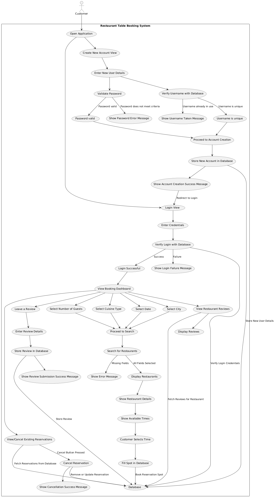

# Requirements

## Use Case Diagram

## Non-Functional Requirements

### Performance
- **Explanation**: The application should quickly return search results and manage user inputs without delay.
- **Implementation**:
    1. Implement database indexing.
    2. Optimize SQL queries to speed up the search for restaurants based on location, cuisine type, and other filters.

### Maintainability
- **Explanation**: The system should be easy to maintain and update, with clear documentation, modular design, and an understandable code structure. This will allow future developers or maintainers to easily comprehend the system and make necessary changes or improvements without significant difficulty.
- **Implementation**:
  1. Ensure the project is well-documented, with clear explanations of how the code works, setup instructions, and how to modify or extend the system.
  3. Use standard coding practices, including meaningful naming conventions and appropriate commenting, to improve readability and long-term maintainability.
  4. Regularly review and refactor the code to remove technical debt and ensure consistency across the codebase.

### Usability
- **Explanation**: The interface will be intuitive and user-friendly, enabling users to quickly navigate the application.
- **Implementation**:
    1. Create a clean, minimalist design.
    2. Add helpful tooltips.
    3. Implement responsive error handling.
    4. Provide user feedback mechanisms.

## Functional Requirements

### **Use Case 1: User Authentication**
- **Actors**: New User, Existing User
- **Use case goal**: Allow users to create new accounts and log in to access the application.
- **Primary Actor**: User
- **Preconditions**:
  - New users must not already be registered in the system.
  - Existing users must have valid credentials.

- **Basic flow**:
  1. If the user is a new user:
    - User enters a **username**, **password**, and **confirm password** in the account creation form.
    - The system, through the `CreateNewAccountController`, validates the inputs:
      - Ensures the username is at least 8 characters long.
      - Validates that the password matches the confirmation password and meets the minimum length requirement.
      - Checks if the username is unique using `UserServices`.
    - If valid:
      - The system creates the new user account using `UserServices.createAccount()`.
      - After successful account creation, the user is automatically logged in and redirected to the **BookNowView**.
  2. If the user is an existing user:
    - User enters their **username** and **password** in the login form.
    - The system, through the `LoginController`, validates the credentials using `UserServices.login()`:
      - Ensures both fields are filled.
      - Verifies the credentials against the database using `UserDAO.login()`.
    - If valid:
      - The system logs the user in and redirects them to the **BookNowView**.

- **Alternative flows**:
  - **Alternative flow 1**: User enters mismatched passwords during account creation.
    - The system displays an error message using `AlertUtil.showInfoAlert()` and prompts the user to correct the input.
  - **Alternative flow 2**: Username is already taken when creating a new account.
    - The system displays an error message using `AlertUtil.showErrorAlert()`, and the user must choose a different username.
  - **Alternative flow 3**: Invalid credentials when logging in.
    - The system displays an error message using `AlertUtil.showErrorAlert()` to inform the user of incorrect credentials.

---

### **Use Case 2: Search Restaurants**
- **Actors**: Customer
- **Use case goal**: Allow customers to search for restaurants based on location, cuisine type, reservation date, and number of guests.
- **Primary Actor**: Customer
- **Preconditions**: Restaurants must be registered in the database.

- **Basic flow**:
  1. Customer navigates to the restaurant search page (managed by `BookNowController`).
  2. Customer selects the following filters:
    - **Location** from a dropdown populated by `RestaurantServices.getCityNames()`.
    - **Cuisine type** from a dropdown populated by `RestaurantServices.getCuisineTypes()`.
    - **Date** using a date picker, ensuring the selected date is not in the past. The system validates that the date is not earlier than the current date.
    - **Number of guests** (adults and children) using dropdowns populated by `IntStream`.
  3. Customer clicks the "Search" button.
  4. The system, through `BookNowController`, validates the inputs using `RestaurantServices.isSearchCriteriaValid()` to ensure that all required fields (location, cuisine type, date) are filled correctly.
  5. If valid:
    - The system retrieves matching restaurants from the database using `RestaurantServices.findAvailableRestaurants()`, which interacts with `RestaurantDAO.getAvailableRestaurants()`.
    - The `BookNowController` dynamically creates a list of matching restaurants and displays them in the UI using the `populateRestaurants()` method with JavaFX `VBox` components.

- **Alternative flows**:
  - **Alternative flow 1**: No restaurants match the search criteria.
    - The system displays an alert using `AlertUtil.showInfoAlert()` informing the user that no restaurants are available for the selected filters.
  - **Alternative flow 2**: Missing or invalid input prompts an error message.
    - The system displays an alert using `AlertUtil.showInfoAlert()` indicating which input is invalid or missing (e.g., no location or date selected).

---

### **Use Case 3: Restaurant Details Page**
- **Actors**: Customer
- **Use case goal**: Allow users to view detailed information about a selected restaurant.
- **Primary Actor**: Customer
- **Preconditions**: Restaurant must be registered in the database.
- **Basic flow**:
    1. Customer selects a restaurant from the search results.
    2. System displays the restaurant's details, including menu, operating hours, and customer reviews.
- **Alternative flows**:
    - **Alternative flow 1**: The selected restaurant has no available information (e.g., menu or reviews not found).

---

### **Use Case 4: Select Reservation**
- **Actors**: Customer
- **Use case goal**: Allow customers to select a reservation time for a chosen restaurant.
- **Primary Actor**: Customer
- **Preconditions**: Customer must be logged in, and restaurant availability must be known.
- **Basic flow**:
    1. Customer selects a restaurant and picks an available reservation time.
    2. System confirms the reservation and sends a confirmation to the customer.
- **Alternative flows**:
    - **Alternative flow 1**: Customer cancels the reservation process.
    - **Alternative flow 2**: Selected time slot is unavailable; the system suggests alternative slots.

---
### **Use Case 5: Cancel Reservation**
- **Actors**: Customer
- **Use case goal**: Enable customers to cancel existing reservations.
- **Primary Actor**: Customer
- **Preconditions**: A valid reservation must exist.
- **Basic flow**:
    1. Customer selects a future reservation.
    2. Customer cancels the reservation.
    3. System updates the reservation status.
- **Alternative flows**:
    - **Alternative flow 1**: Reservation is not cancellable (e.g., within a restricted time window).

---

### **Use Case 6: Leave a Review**
- **Actors**: Customer
- **Use case goal**: Enable customers to leave reviews for restaurants they have visited.
- **Primary Actor**: Customer
- **Preconditions**: Customer must have made a reservation.
- **Basic flow**:
    1. Customer selects a past reservation.
    2. Customer submits a review and rating for the restaurant.
    3. System saves the review and updates the restaurant’s rating.
- **Alternative flows**:
    - **Alternative flow 1**: The customer cancels before submitting the review.

---