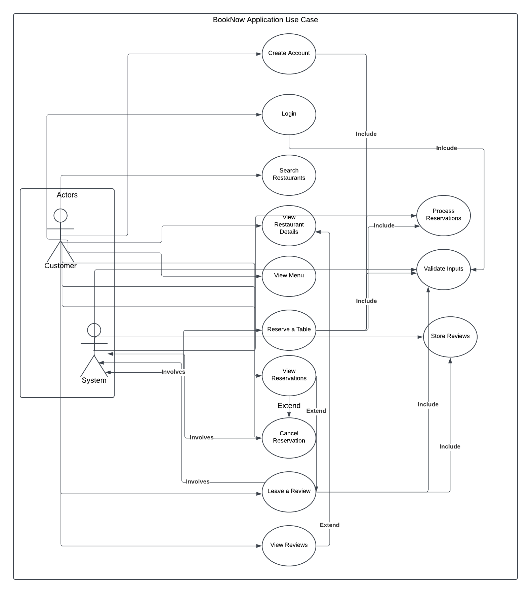

# Requirements

## Use Case Diagram

## Non-Functional Requirements

### Performance
- **Explanation**: The application should quickly return search results and manage user inputs without delay.
- **Implementation**:
    1. Implement database indexing.
    2. Optimize SQL queries to speed up the search for restaurants based on location, cuisine type, and other filters.

### Maintainability
- **Explanation**: The system should be easy to maintain and update, with clear documentation, modular design, and an understandable code structure. This will allow future developers or maintainers to easily comprehend the system and make necessary changes or improvements without significant difficulty.
- **Implementation**:
  1. Ensure the project is well-documented, with clear explanations of how the code works, setup instructions, and how to modify or extend the system.
  3. Use standard coding practices, including meaningful naming conventions and appropriate commenting, to improve readability and long-term maintainability.
  4. Regularly review and refactor the code to remove technical debt and ensure consistency across the codebase.

### Usability
- **Explanation**: The interface will be intuitive and user-friendly, enabling users to quickly navigate the application.
- **Implementation**:
    1. Create a clean, minimalist design.
    2. Add helpful tooltips.
    3. Implement responsive error handling.
    4. Provide user feedback mechanisms.

## Functional Requirements

# Use Case 1: Create New Account

## Actors
- **Customer**

## Use Case Goal
- Allow new users to create an account to access the application.

## Primary Actor
- **Customer**

## Preconditions
- The user must not already have an account registered in the system.

## Basic Flow
1. The user enters a username, password, and confirm password in the `CreateNewAccountController` form.
2. `CreateNewAccountController` calls `UserService.validateAndCreateAccount()` to validate the inputs:
  - Ensures the username is at least 8 characters long.
  - Verifies that the password matches the confirmation password and is at least 8 characters long.
  - Uses `UserDAO.login()` to check if the username already exists in the database.
3. If inputs are valid:
  - The system creates a new account with `UserDAO.createAccount()` via `UserService`.
4. After successful account creation, the `CreateNewAccountController`:
  - Sets the global `UIUtil.USER` variable to the new username.
  - Redirects the user to the `LoginView` for them to log in.

## Alternative Flows

### Mismatched Passwords
- `CreateNewAccountController` calls `UIUtil.displayAlert()` to inform the user that the password and confirm password do not match and prompts them to re-enter both.

### Username Already Taken
- If `UserDAO.login()` finds that the username already exists, `CreateNewAccountController` calls `UIUtil.displayAlert()` to notify the user and prompts them to choose a different username.

### Missing Input
- If any of the required fields (username, password, or confirm password) are left empty, the system displays a corresponding error message using `UIUtil.displayAlert()`.

## Postconditions
- A new user account is stored in the database.
- The user is redirected to log in.

----

# Use Case 2: Login

## Actors
- **Customer**

## Use Case Goal
- Allow existing users to log in to the application.

## Primary Actor
- **Customer**

## Preconditions
- The user must already have an account registered in the system with valid credentials.

## Basic Flow
1. The user enters their username and password in the `LoginController`.
2. `LoginController` validates the credentials by calling `UserService.login()`:
  - Checks that the username and password fields are filled.
  - Uses `UserDAO.login()` to verify credentials against the database.
3. If valid:
  - The system sets the global `UIUtil.USER` variable to the username.
  - The `LoginController` redirects the user to the `BookNowView`.

## Alternative Flows

### Invalid Login Credentials
- If the entered username or password is incorrect, `LoginController` displays an error message using `UIUtil.displayAlert()` and allows the user to try again.

### Missing Input
- If the username or password field is empty, `LoginController` displays an error message using `UIUtil.displayAlert()`.

## Postconditions
- The user successfully logs in.
- The system redirects the user to the main application interface (`BookNowView`).

----

# Use Case 3: Search Restaurants

## Actors
- **Customer**

## Use Case Goal
- Allow customers to search for restaurants based on location, cuisine type, reservation date, and number of guests.

## Primary Actor
- **Customer**

## Preconditions
- Restaurants must be registered in the database.

## Basic Flow

### Navigate to Search Page
1. The customer navigates to the search page, which is managed by the `BookNowController`.

### Filter Selection
2. The customer selects filters for the search:
  - **Location**: Selected from the `locationComboBox` dropdown, populated by `BookNowController` using `RestaurantService.fetchCityNames()`.
  - **Cuisine Type**: Selected from the `cb_cuisineType` dropdown, populated by `RestaurantService.fetchCuisineTypes()`.
  - **Date**: Selected using the `checkInDate` date picker, validated to ensure it is not earlier than the current date.
  - **Number of Guests**: Selected using the `cb_adults` and `cb_children` dropdowns.

### Initiate Search
3. The customer clicks the "Search" button.
4. The `BookNowController`’s `onSearchButtonClick()` method handles the search by gathering the selected filters.

### Input Validation
5. `BookNowController` validates the input using helper methods to ensure:
  - Location and Cuisine Type fields are not empty.
  - The selected date is valid (not in the past).
  - At least one adult is included in the guest count.

### Retrieve and Display Results
6. If validation succeeds:
  - `RestaurantService.getAvailableRestaurants()` is called to retrieve matching restaurants based on the selected filters.
  - The `RestaurantDAO.getAvailableRestaurants()` method queries the database for matching restaurants.
  - `RestaurantUIManager.populateRestaurantListVBox()` is called to dynamically create and display the list of matching restaurants in the `restaurantListVBox`.

## Alternative Flows

### Alternative Flow 1: No Matching Restaurants
- If no restaurants match the selected filters:
  - The system displays an alert using `UIUtil.displayAlert()` to notify the customer that no restaurants are available.

### Alternative Flow 2: Missing or Invalid Input
- If any required input is missing or invalid:
  - The system displays an alert using `UIUtil.displayAlert()` to indicate the specific missing or invalid field (e.g., missing location or invalid date).

----

# Use Case 4: View Restaurant Details

## Actors
- **Customer**

## Use Case Goal
- Allow customers to view detailed information about a selected restaurant.

## Primary Actor
- **Customer**

## Preconditions
- The restaurant must be registered in the database.

## Basic Flow

### Select Restaurant
1. The customer selects a restaurant from the search results displayed in the main search page, managed by `BookNowController`.
  - This triggers the `BookNowController.handleReadReviews(restaurant)` method, which loads the restaurant details.

### Display Restaurant Information
2. The `BookNowController` gathers and displays detailed information about the selected restaurant by:

   #### Displaying the Menu:
  - Calls `RestaurantUIManager.viewMenu(restaurant)` to open the restaurant’s menu as a PDF using the system’s default PDF viewer.
  - The `RestaurantUIManager.loadPDF()` method retrieves the menu file based on the restaurant's specified file path.

   #### Fetching and Displaying Reviews:
  - Calls `ReviewService.getReviewsByRestaurantId(restaurantId)` to retrieve the customer reviews from the database.
  - Displays the reviews dynamically in the `reviewsOverlay` `VBox` using `RestaurantUIManager.displayReviews(reviews)`.

   #### Showing Additional Details:
  - Displays the restaurant's name, location, and description within the `BookNowController`'s UI layout.

## Alternative Flows

### Alternative Flow 1: Missing Restaurant Information

#### Menu Not Found
- If `RestaurantUIManager.viewMenu()` fails to locate the menu file:
  - The system displays an alert using `UIUtil.displayAlert("Error", "Menu not available for this restaurant.")`.

#### No Reviews Available
- If `ReviewService.getReviewsByRestaurantId()` returns no reviews:
  - `RestaurantUIManager.displayReviews()` displays an empty message such as "No reviews yet" in the `reviewsOverlay` `VBox`.

----

# Use Case 5: View Menu

## Actors
- **Customer**

## Use Case Goal
- Allow users to view the menu of a selected restaurant in PDF format.

## Primary Actor
- **Customer**

## Preconditions
- The restaurant must be registered in the database.
- A valid menu PDF file must be associated with the restaurant.

## Basic Flow
1. The user selects a restaurant from the list of search results displayed in the `BookNowController` UI.
2. The system fetches the restaurant's details and allows the user to view the menu by clicking the "View Menu" button.
3. The `RestaurantUIManager.viewMenu(restaurant)` method is triggered.
4. The system performs the following steps:
  - It retrieves the menu PDF file path using the `Restaurant.getMenuPdf()` method.
  - The `RestaurantUIManager.loadPDF()` method loads the specified menu file from the `/menus/` directory in the application's resources.
  - A temporary file is created for the PDF if it is not accessible directly.
  - The system opens the menu using the default PDF viewer on the user's device through the `Desktop.getDesktop().open()` method.
5. If successful, the menu is displayed to the user.

## Alternative Flows

### Alternative Flow 1: Menu Not Found
**Condition**: If the menu file does not exist or cannot be retrieved.  
**Action**:
- The `RestaurantUIManager.viewMenu()` method triggers `UIUtil.displayAlert()` with an error message:
  - **Error Message**: "Menu not found."
- The system logs the error and gracefully returns to the previous state.

### Alternative Flow 2: System Does Not Support PDF Viewing
**Condition**: If the user's system does not support opening PDF files (e.g., no compatible viewer installed).  
**Action**:
- The system displays an error message using `UIUtil.displayAlert()`:
  - **Error Message**: "PDF viewing not supported on this system."
- The system logs the error for troubleshooting.

### Alternative Flow 3: Menu File Load Error
**Condition**: If an error occurs while loading or accessing the menu PDF.  
**Action**:
- The `RestaurantUIManager.viewMenu()` method catches the exception and displays an error message:
  - **Error Message**: "Error opening the PDF file."
- The system logs the error for further debugging.

## Postconditions
- The menu is either displayed to the user successfully, or an appropriate error message is shown.

----

# Use Case 6: Reserve a Table

## Actors
- **Customer**

## Use Case Goal
- Enable customers to reserve a table at a selected restaurant for a specific date and time.

## Primary Actor
- **Customer**

## Preconditions
- The customer must be logged in.
- The restaurant must have available tables for the selected date, time, and number of guests.
- The reservation date must be in the future.

## Basic Flow
1. The user selects a restaurant from the list of search results displayed by the `BookNowController`.
2. The customer clicks the "Show Availability" button for the restaurant.
3. The `BookNowController` calls `handleShowAvailability()` to retrieve available tables and time slots using `TableService.getAvailableTables()` and `TableService.getAvailableTimeSlots()`.
4. The system dynamically displays available tables and time slots in a TableView using `RestaurantUIManager.createTableView()`.
5. The customer selects a time slot from the dropdown menu in the table view.
6. The customer clicks the "Reserve" button for a specific table.
7. The `BookNowController.handleReserveTable()` method is triggered, which:
  - Calls `TableService.reserveTable()` with the reservation details, including:
    - Username
    - Restaurant ID
    - Selected date
    - Selected time slot
    - Table number
8. The system validates the reservation details and saves the reservation to the database using `TableDAO.reserveTable()`.
9. Upon successful reservation, the system displays a confirmation message using `UIUtil.displayAlert()`:
  - **Message**: "Reservation Confirmed."

## Alternative Flows

### Alternative Flow 1: No Available Tables
**Condition**: If there are no available tables for the selected date, time, or number of guests.  
**Action**:
- The system displays an error message using `UIUtil.displayAlert()`:
  - **Message**: "No available tables for the selected date and time."

### Alternative Flow 2: Selected Time Slot Becomes Unavailable
**Condition**: If the selected time slot becomes unavailable after it is selected (e.g., another user reserves the same time slot).  
**Action**:
- The system refreshes the list of available time slots using `TableService.getAvailableTimeSlots()` and updates the dropdown menu in the TableView.
- An error message is displayed using `UIUtil.displayAlert()`:
  - **Message**: "Selected time slot is no longer available. Please select another slot."

### Alternative Flow 3: Invalid Reservation Details
**Condition**: If the reservation details are invalid (e.g., past date or invalid guest count).  
**Action**:
- The system prevents the reservation and displays an error message using `UIUtil.displayAlert()`:
  - **Message**: "Invalid reservation details. Please check your inputs."

### Alternative Flow 4: Database Error
**Condition**: If a database error occurs while saving the reservation.  
**Action**:
- The system displays an error message using `UIUtil.displayAlert()`:
  - **Message**: "An error occurred while processing your reservation. Please try again later."
- The system logs the error for further debugging.

## Postconditions
- The reservation is successfully saved in the database, and the user receives confirmation.
- The system updates the restaurant's table availability to reflect the new reservation.

----

# Use Case 7: View My Reservations

## Actors
- **Customer**

## Use Case Goal
- Enable customers to view their existing reservations.

## Primary Actor
- **Customer**

## Preconditions
- The customer must be logged in.
- The system must have reservation data associated with the logged-in user.

## Basic Flow
1. The customer navigates to the "View My Reservations" page from the main application interface.
2. The `BookNowController` calls `showMyReservationsView()` to load the reservation view managed by the `ReservationsController`.
3. The `ReservationsController` retrieves the list of reservations for the logged-in user by:
  - Calling `ReservationService.getUserReservations()` with the username.
  - `ReservationService` uses `ReservationDAO.getUserReservations()` to query the database for reservations associated with the username.
4. The system displays the list of reservations in a `TableView` with columns for:
  - Restaurant Name
  - Reservation Date
  - Time Slot
  - Table Number
  - Actions (e.g., Cancel Reservation or Leave a Review).
5. The customer views the reservation details directly in the table.

## Alternative Flows

### Alternative Flow 1: No Reservations Found
**Condition**: The customer has no active or past reservations.  
**Action**:
- The system displays a message in the `TableView`:
  - **Message**: "No reservations found."
- The customer can navigate back to the main application to make a new reservation.

### Alternative Flow 2: Database Error
**Condition**: A database error occurs while retrieving reservation data.  
**Action**:
- The system displays an error message using `UIUtil.displayAlert()`:
  - **Message**: "Unable to load your reservations. Please try again later."
- The system logs the error for further debugging.

## Postconditions
- The list of reservations is successfully displayed to the customer.
- The customer can interact with each reservation to perform additional actions like canceling or leaving a review.

----

# Use Case 8: Cancel a Reservation

## Actors
- **Customer**

## Use Case Goal
- Enable customers to cancel an existing reservation.

## Primary Actor
- **Customer**

## Preconditions
- The customer must be logged in.
- The system must have an active reservation associated with the customer.
- The reservation must be eligible for cancellation (not restricted by policies like being within 24 hours of the reservation time).

## Basic Flow
1. The customer navigates to the "View My Reservations" page.
2. The `BookNowController` calls `showMyReservationsView()` to load the reservations view managed by `ReservationsController`.
3. The `ReservationsController` displays the customer's reservations in a `TableView`:
  - Each reservation has a "Cancel Reservation" button, added dynamically by `ReservationUIManager.createActionButton()`.
4. The customer clicks the "Cancel Reservation" button for the desired reservation.
5. `ReservationUIManager.cancelReservation()` is called with the reservation ID and the observable reservations list:
  - It calls `ReservationService.cancelReservation()` to process the cancellation.
  - `ReservationService` uses `ReservationDAO.cancelReservation()` to remove the reservation from the database.
6. The system removes the canceled reservation from the displayed list in the `TableView`.
7. The system displays a confirmation message using `UIUtil.displayAlert()`:
  - **Message**: "Reservation successfully canceled!"

## Alternative Flows

### Alternative Flow 1: Reservation Not Eligible for Cancellation
**Condition**: The customer tries to cancel a reservation within a restricted time frame (e.g., less than 24 hours in advance).  
**Action**:
- The system disables the "Cancel Reservation" button for ineligible reservations.
- The system displays an alert:
  - **Message**: "This reservation cannot be canceled within 24 hours of the reservation time."

### Alternative Flow 2: Database Error
**Condition**: The database fails to process the cancellation request.  
**Action**:
- The system displays an error message using `UIUtil.displayAlert()`:
  - **Message**: "Failed to cancel the reservation. Please try again later."
- The reservation remains in the list.

## Postconditions
- The reservation is successfully removed from the database.
- The customer receives confirmation of the cancellation.

----

# Use Case 9: Leave a Review

## Actors
- **Customer**

## Use Case Goal
- Enable customers to leave reviews for restaurants they have visited.

## Primary Actor
- **Customer**

## Preconditions
- The customer must be logged in.
- The customer must have a completed reservation for the restaurant.
- The reservation must be eligible for review (past the reservation date and not previously reviewed).

## Basic Flow
1. The customer navigates to the "View My Reservations" page using `BookNowController.showMyReservationsView()`.
2. The `ReservationsController` displays a list of reservations using `ReservationUIManager.loadReservations()`.
3. For eligible reservations:
  - The system dynamically displays a "Leave a Review" button next to the reservation using `ReservationUIManager.createActionButton()`.
4. The customer clicks the "Leave a Review" button.
5. The system opens the review submission form:
  - `ReservationUIManager` calls `UIUtil.displaySceneWithController()` to load the `CreateReviewView.fxml`.
  - Passes the reservation ID to `CreateReviewController`.
6. The customer fills in the review details:
  - Selects a rating (1-5) from the `ComboBox` (`combo_rating`).
  - Enters feedback in the `TextArea` (`txt_reviewComment`).
7. The customer clicks the "Submit Review" button.
8. `CreateReviewController.onSubmitReviewClickAction()` validates the input by calling `ReviewService.validateAndSubmitReview()`:
  - Ensures the rating is selected and feedback is provided.
  - Calls `ReviewDAO.submitReview()` to save the review in the database.
9. Upon successful submission, the system displays a confirmation message using `UIUtil.displayAlert()`:
  - **Message**: "Thank you for leaving a review!"

## Alternative Flows

### Alternative Flow 1: Missing or Incomplete Review Information
**Condition**: The customer attempts to submit the review without selecting a rating or entering feedback.  
**Action**:
- `ReviewService.validateAndSubmitReview()` returns an error message.
- The system displays an alert using `UIUtil.displayAlert()`:
  - **Message**: "Please select a rating and provide feedback."

### Alternative Flow 2: Customer Cancels Review Submission
**Condition**: The customer closes the review form without submitting the review.  
**Action**:
- No review is saved.
- The customer is returned to the "View My Reservations" page.

### Alternative Flow 3: Reservation Not Eligible for Review
**Condition**: The reservation is not eligible for a review (e.g., it is upcoming or has already been reviewed).  
**Action**:
- The system disables the "Leave a Review" button.
- If the reservation has already been reviewed, the button is replaced with "View Your Review".

## Postconditions
- The review is successfully saved in the database.
- The review appears in the "View My Reviews" page.

----

# Use Case 10: View My Reviews

## Actors
- **Customer**

## Use Case Goal
- Enable customers to view the reviews they have left for various restaurants.

## Primary Actor
- **Customer**

## Preconditions
- The customer must be logged in.
- The customer must have submitted at least one review in the past.

## Basic Flow
1. The customer navigates to the "View My Reviews" page via the main menu or a button managed by `BookNowController.showMyReviewsView()`.
2. `ReviewController` loads the review data using:
  - `ReviewUIManager.loadReviews()` which calls `ReviewService.getReviewsByUsername()` with the logged-in customer's username.
  - `ReviewService` retrieves the reviews by calling `ReviewDAO.getReviewsByUsername()` to fetch them from the database.
3. The reviews are displayed in a `TableView` (`reviewsTable`) using `ReviewUIManager.setUpTableColumns()`:
  - Each review shows:
    - Restaurant name
    - Date of experience
    - Rating (stars or numbers)
    - Feedback (comments)
4. The customer scrolls through the list to view their reviews.

## Alternative Flows

### Alternative Flow 1: No Reviews Found
**Condition**: The customer has not submitted any reviews.  
**Action**:
- `ReviewUIManager` displays a message in the `reviewsTable`:
  - **Message**: "No reviews yet."

### Alternative Flow 2: Data Retrieval Error
**Condition**: The database fails to retrieve review data due to a system issue.  
**Action**:
- The system displays an alert using `UIUtil.displayAlert()`:
  - **Title**: "Error"
  - **Message**: "Failed to load your reviews. Please try again later."

## Postconditions
- The customer successfully views their submitted reviews.
- If there are no reviews, the system informs the customer appropriately.

----

# Use Case 11: Process Reservations

## Actors
- **System**

## Use Case Goal
- Ensure reservation requests made by customers are validated, stored in the database, and made available for subsequent actions like viewing or cancellation.

## Primary Actor
- **System**

## Preconditions
- A reservation request has been submitted by a logged-in customer.
- The selected restaurant, table, date, and time slot must be available.

## Basic Flow
1. The System receives a reservation request from the `TableService.reserveTable()` method.
2. `TableService` validates the request by:
  - Checking the availability of the table using `TableDAO.getAvailableTables()`.
  - Ensuring no conflicts exist with other reservations for the same table and time slot.
3. If the table is available:
  - The System processes the reservation by calling `TableDAO.reserveTable()`, which:
    - Stores the reservation in the database with details like:
      - Customer username
      - Restaurant ID
      - Date
      - Time slot
      - Table number
4. The System confirms the reservation by returning a success response to the calling service (`BookNowController` or `RestaurantUIManager`).

## Alternative Flows

### Alternative Flow 1: Table or Time Slot Unavailable
**Condition**: The requested table or time slot is no longer available.  
**Action**:
- The System returns a failure response to `TableService.reserveTable()`.
- The UI displays an error message using `UIUtil.displayAlert()`:
  - **Title**: "Reservation Failed"
  - **Message**: "The selected table or time slot is no longer available. Please choose a different option."

### Alternative Flow 2: Database Connection Failure
**Condition**: The database connection fails during the reservation process.  
**Action**:
- The System logs the error.
- The UI displays an error message using `UIUtil.displayAlert()`:
  - **Title**: "System Error"
  - **Message**: "Failed to process your reservation. Please try again later."

### Alternative Flow 3: Validation Failure
**Condition**: The customer’s request is invalid.  
**Action**:
- The System rejects the request and sends feedback to the customer via the UI.

## Postconditions
- The reservation is successfully stored in the database if the process completes without errors.
- The table’s availability is updated to reflect the reservation.
- If the process fails, appropriate error messages are shown to the customer.

---

# Use Case 12: Validate Inputs

## Actors
- **System**

## Use Case Goal
- Ensure that user inputs are valid before performing operations like account creation, login, reservation, or review submission.

## Primary Actor
- **System**

## Preconditions
- Input fields are populated or provided by the user.

## Basic Flow
1. The system receives input from the user (e.g., during account creation, login, reservation, or review submission).
2. Validation Rules are applied:
  - **For account creation**:
    - Username must be at least 8 characters.
    - Password must match the confirmation password and be at least 8 characters long.
  - **For login**:
    - Both username and password fields must be filled.
    - Credentials must match a record in the database.
  - **For reservation**:
    - Location and cuisine type must not be empty.
    - The date must not be in the past.
    - Guest count (adults and children) must include at least one adult.
  - **For reviews**:
    - Rating must be selected.
    - Feedback must not be blank or empty.
3. If inputs are valid:
  - The system allows the operation to proceed (e.g., creating an account, logging in, reserving a table, or leaving a review).
4. If inputs are invalid:
  - An error message is displayed, indicating the specific issue (e.g., "Username must be at least 8 characters").

## Alternative Flows

### Alternative Flow 1: Missing or Invalid Input
**Condition**: Any input is missing or invalid.  
**Action**:
- The system halts the operation.
- Displays an appropriate error message to the user using `UIUtil.displayAlert()`.
- Prompts the user to correct the input.

### Alternative Flow 2: User Attempts Invalid Action
**Condition**: The user attempts to proceed with incomplete or incorrect data.  
**Action**:
- The system prevents the operation and highlights the fields that need correction.

## Postconditions
- The system either proceeds with the operation if inputs are valid or informs the user to correct the inputs if they are invalid.

----

# Use Case 13: Store Reviews

## Actors
- **System**

## Use Case Goal
- Ensure reviews submitted by customers are stored securely and accurately in the database.

## Primary Actor
- **System**

## Preconditions
- A customer must have completed a valid reservation at a restaurant.
- The customer must have provided a review with a rating and feedback.

## Basic Flow
1. **Receive Review Submission:**
  - The system receives the review data when the customer submits the review through `CreateReviewController`.

2. **Validate Review Data:**
  - The system calls `ReviewService.validateAndSubmitReview()` to ensure the review meets the following criteria:
    - A rating between 1 and 5 is provided.
    - Feedback text is not empty or blank.

3. **Store Review in Database:**
  - If validation passes:
    - `ReviewService.submitReview()` is called, which uses `ReviewDAO.submitReview()` to store the review in the database.
    - The review includes the following details:
      - Username
      - Restaurant ID
      - Reservation ID
      - Rating
      - Feedback
      - Date of experience

4. **Confirm Storage:**
  - The system confirms successful storage by notifying the customer via `UIUtil.displayAlert("Success", "Review successfully submitted!")`.

## Alternative Flows

### Alternative Flow 1: Validation Fails
**Condition**: The review data does not meet validation criteria.  
**Action**:
- The system returns an error message from `ReviewService.validateAndSubmitReview()` to `CreateReviewController`.
- An alert is displayed to the customer using `UIUtil.displayAlert()` to correct the missing or invalid data.

### Alternative Flow 2: Database Error
**Condition**: The system encounters a database issue during review storage.  
**Action**:
- `ReviewDAO.submitReview()` throws an exception.
- The system displays an error message to the customer via `UIUtil.displayAlert("Error", "Failed to save review. Please try again later.")`.

## Postconditions
- The review is securely stored in the database if validation and storage are successful.
- The customer is informed of the successful submission or any encountered issues that need correction.